# NoSQL Assignment 1 — Spotify Analytics Platform

## Student

**Name:** Oleksandra Dembitska

Course: NoSQL & Vector Databases

---

# Project Overview

This project demonstrates the use of MongoDB Atlas as a document-oriented database for storing and analyzing Spotify tracks.

The dataset contains approximately **114,000 Spotify tracks** with audio characteristics such as:

- danceability
- energy
- popularity
- valence
- tempo
- loudness
- speechiness
- acousticness
- duration
- genre

The project includes:

- importing CSV into MongoDB;
- transforming the schema using Aggregation Pipeline;
- querying nested documents and arrays;
- analytical aggregations;
- index creation;
- performance analysis using explain().

---

# Technologies

- MongoDB Atlas
- MongoDB Shell (mongosh)
- MongoDB Aggregation Framework
- Python 3
- PyMongo
- Pandas
- VS Code

---

# Repository Structure

```text
.
├── .env
├── .gitignore
├── requirements.txt
├── dataset.csv
│
├── scripts
│   ├── 01_load_data.py
│   └── 02_transform.js
│
├── queries
│   ├── part2_queries.js
│   ├── part3_aggregations.js
│   └── part4_indexes.js
│
├── screenshots
│
└── README.md
```

---

# Installation

Install dependencies

```bash
pip install -r requirements.txt
```

Create `.env`

```env
MONGO_URI=your_connection_string
```

---

# Part 1 — Loading and Schema Design

## Loading dataset

```bash
python scripts/01_load_data.py
```

The script:

- connects to MongoDB Atlas;
- loads dataset.csv;
- converts records into JSON documents;
- inserts data into **tracks_raw**.

### Result

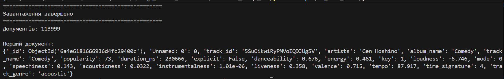

---

## Transforming documents

```bash
mongosh "YOUR_CONNECTION_STRING" --file scripts/02_transform.js
```

Transformation creates a new collection **tracks**.

Changes:

- artists → array;
- audio features → nested object;
- duration converted into seconds;
- popularity tier added;
- original artists string preserved.

### Result

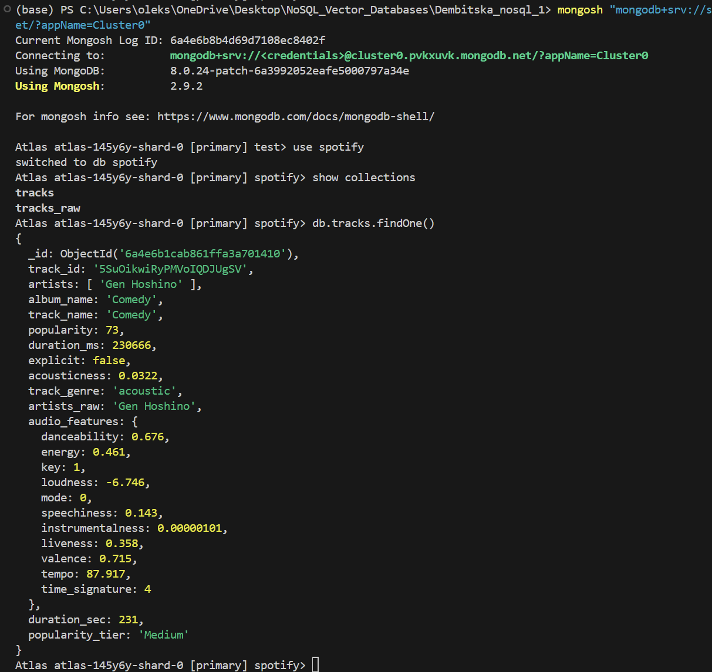

---

# Part 1 — Theory

## Why are audio features stored as a nested object?

Fields such as danceability, energy, loudness, tempo and speechiness all describe one logical entity — the audio characteristics of a track. Grouping them into the `audio_features` object makes the schema easier to understand and avoids cluttering the top level of the document.

Advantages:

- better logical organization;
- easier maintenance;
- related fields stay together;
- simplifies nested queries.

Possible disadvantage:

Very deeply nested documents may require longer field paths and slightly more complex indexes.

---

## Why is artists stored as an array?

A track may have one or several artists.

Using an array allows MongoDB to:

- store any number of artists;
- efficiently use `$unwind`;
- search with `$in`;
- aggregate statistics for every individual artist.

If artists were stored as one string, aggregation and filtering would become much more complicated.

---

## Difference between `$out` and `$merge`

### `$out`

- completely replaces the target collection;
- useful when rebuilding the entire dataset.

### `$merge`

- updates existing documents;
- can insert only new documents;
- useful for incremental ETL pipelines.

In this project `$out` was chosen because the transformed collection is recreated from scratch.

---

# Part 2 — Queries

## Task 1 — Party tracks

Conditions:

- danceability > 0.7
- energy > 0.7
- duration 180–300 seconds

Result

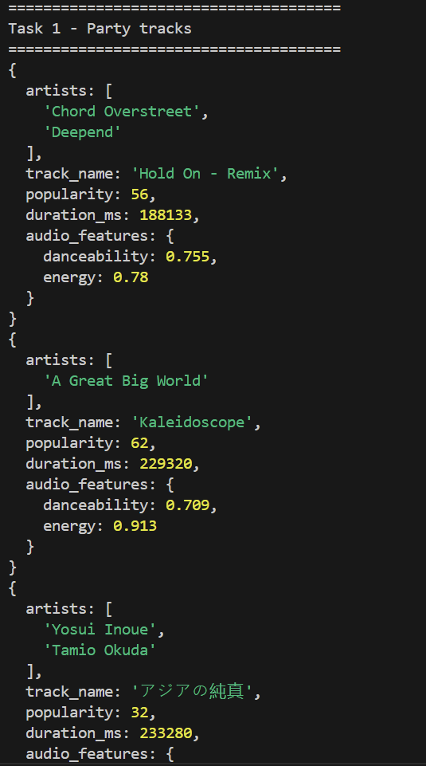

---

## Task 2 — Popular artists

Aggregation:

- `$unwind`
- `$group`
- average popularity
- track count

Result

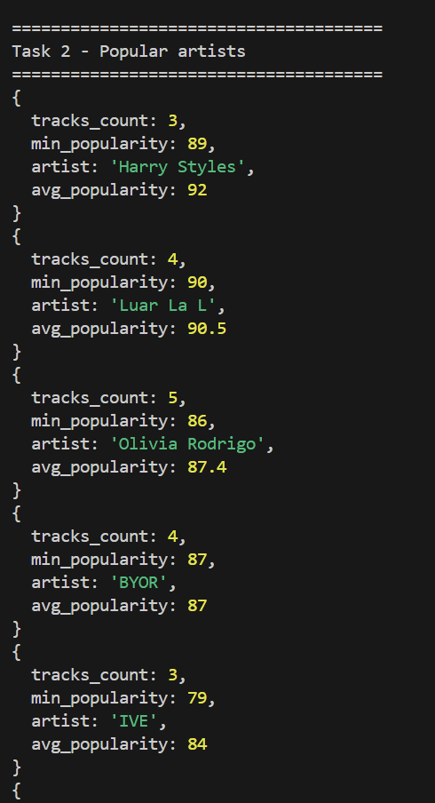

---

## Task 3 — Unusual tracks

Tracks whose tempo is significantly higher than the average tempo of their genre.

Statistics are calculated using:

- `$avg`
- `$stdDevPop`

Result

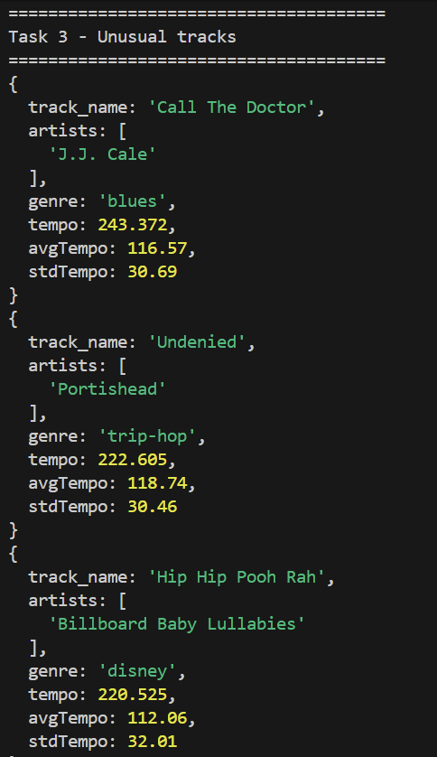

---

## Task 4 — Background tracks

Filters:

- instrumentalness > 0.5
- speechiness < 0.1
- loudness < -10
- explicit = false

Result

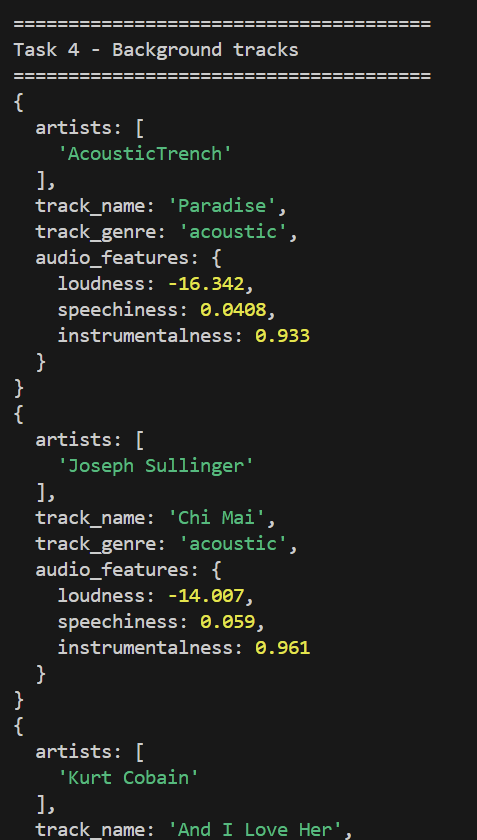

---

# Part 2 — Theory

## What does `$unwind` do?

`$unwind` splits an array into multiple documents.

Example:

```
artists = ["A","B","C"]
```

becomes

```
A
B
C
```

This allows grouping, counting and calculating statistics for each artist individually.

---

## Difference between `$stdDevPop` and `$stdDevSamp`

`$stdDevPop`

Calculates standard deviation assuming the dataset is the entire population.

`$stdDevSamp`

Calculates standard deviation assuming the dataset is only a sample.

Since the Spotify dataset contains all available records used in this analysis, `$stdDevPop` is appropriate.

---

# Part 3 — Aggregation Pipelines

## Task 1 — Top artists

Result

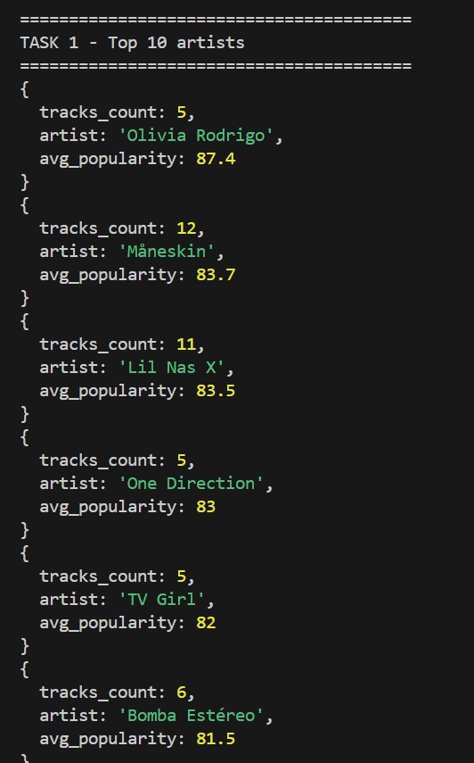

---

## Task 2 — Mood distribution

Tracks are classified into:

- happy
- calm
- angry
- sad

Result

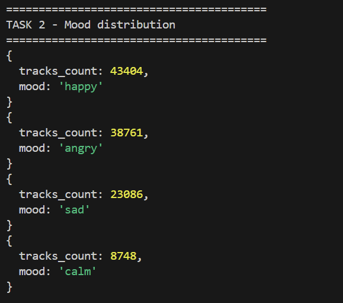

---

## Task 3 — Most danceable genres

Statistics include:

- average danceability;
- average energy;
- average valence.

Result

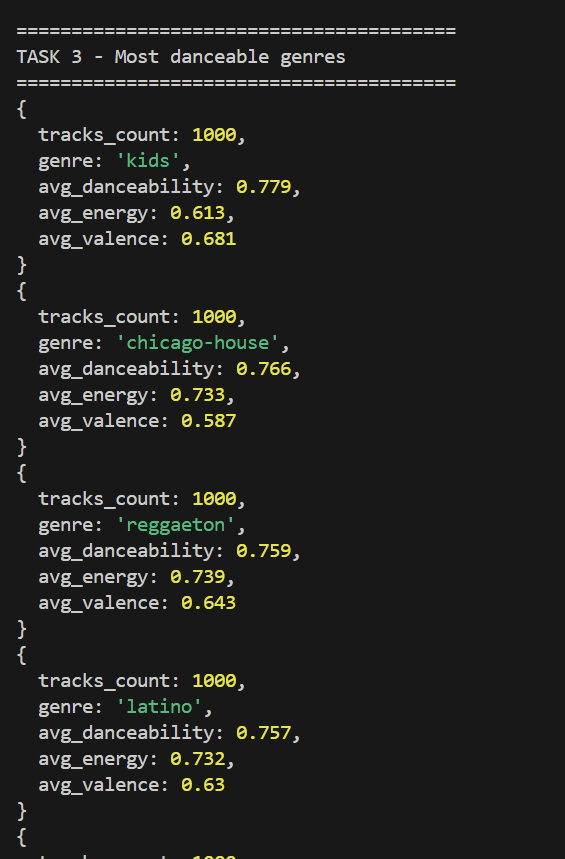

---

# Part 3 — Theory

## What happens if the minimum number of tracks changes?

Current threshold:

```
tracks_count >= 5
```

If reduced to **1**, many artists with only one song appear, making the ranking less reliable.

If increased to **50**, only very large artists remain and many popular but less prolific artists disappear.

---

## What happens if the genre threshold changes?

Current threshold:

```
tracks_count >= 100
```

If reduced to **50**, more genres appear but averages become less stable.

If increased to **500**, only the largest genres remain and the ranking becomes more statistically reliable.

---

# Part 4 — Indexes

## Explain BEFORE index

The query performs a full collection scan (**COLLSCAN**).

Result

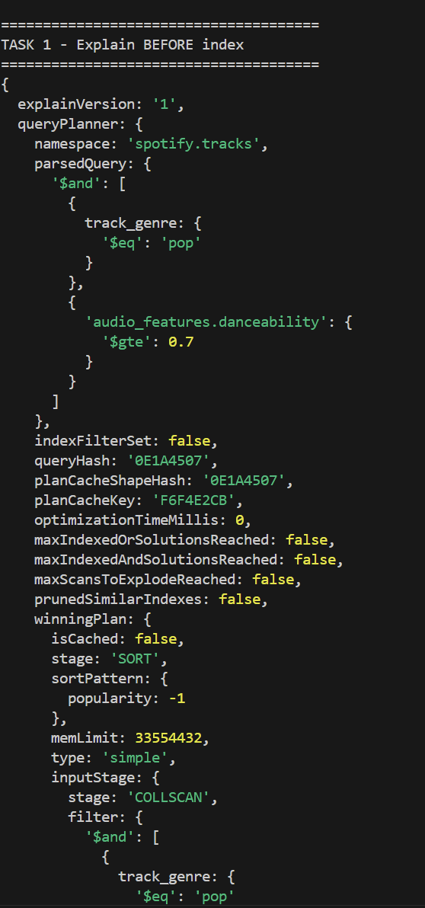

---

## Compound index

```javascript
{
track_genre:1,
"audio_features.danceability":1,
popularity:-1
}
```

Result

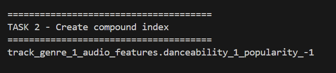

---

## Explain AFTER index

MongoDB switches to **IXSCAN**, significantly reducing scanned documents.

Result

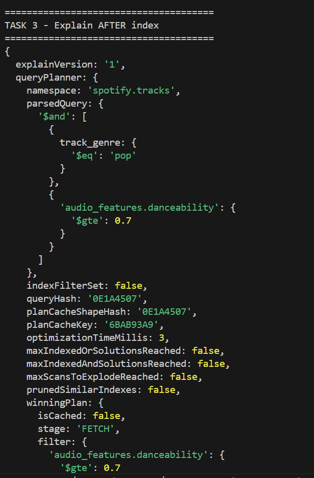

---

## Recommendation index

Compound index

```javascript
{
"audio_features.instrumentalness":1,
"audio_features.speechiness":1,
explicit:1
}
```

Result

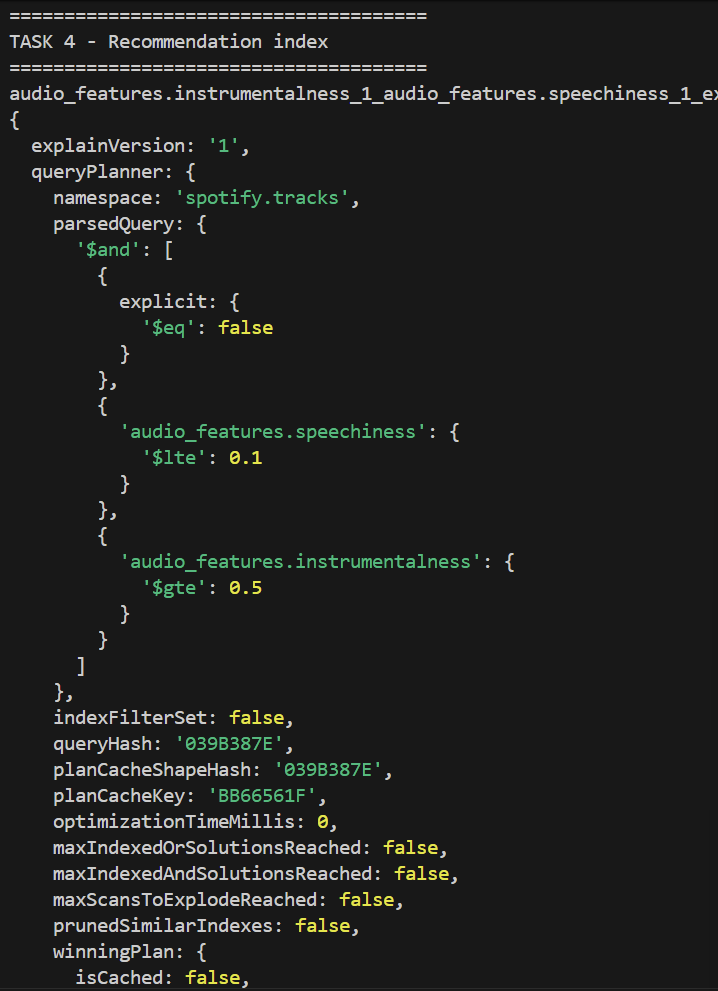

---

## Covered Query

MongoDB executes the query using **PROJECTION_COVERED**.

Result

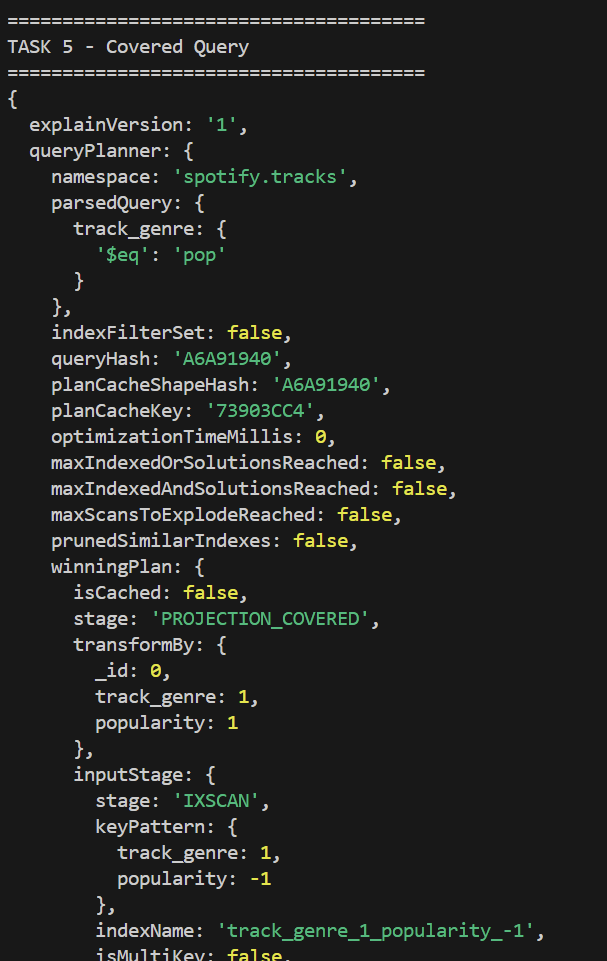

---

# Explain Comparison

| Before | After |
|---------|-------|
| COLLSCAN | IXSCAN |
| Full collection scan | Index scan |
| Slower | Faster |

---

# What is a Covered Query?

A Covered Query is a query where:

- every filter field belongs to the index;
- every returned field belongs to the same index;
- MongoDB answers directly from the index without reading collection documents.

Advantages:

- fewer disk reads;
- lower latency;
- better performance.

---

# Conclusion

During this assignment:

- MongoDB Atlas cluster was deployed;
- Spotify dataset (~114k tracks) was imported;
- a document-oriented schema was designed;
- nested documents and arrays were used;
- analytical aggregation pipelines were implemented;
- compound indexes were created;
- query performance was analyzed using `explain()`;
- Covered Query optimization was demonstrated.