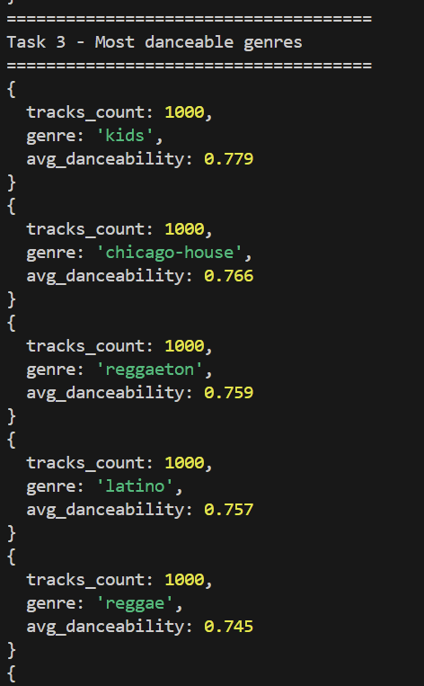
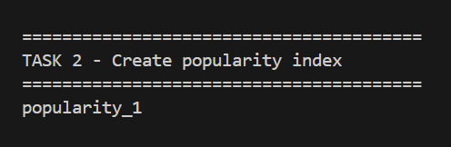
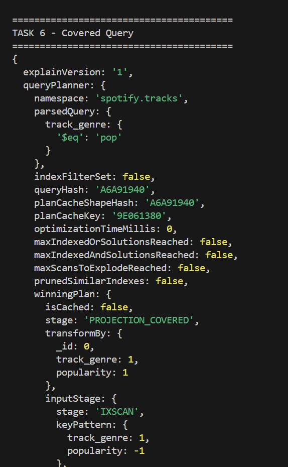

# NoSQL Assignment 1 — Spotify Analytics Platform

## Student

**Name:** Oleksandra Dembitska

Course: NoSQL & Vector Databases

---

# Project Overview

This project demonstrates the use of **MongoDB Atlas** as a document-oriented database for storing and analyzing Spotify tracks.

The dataset contains approximately **114,000 songs** with audio characteristics such as:

- danceability
- energy
- valence
- popularity
- tempo
- loudness
- speechiness
- acousticness
- duration
- genre

The project covers the complete workflow:

- loading CSV data into MongoDB
- transforming documents into a better schema
- querying nested documents
- building aggregation pipelines
- creating indexes
- analyzing query performance using `explain()`

---

# Technologies

- MongoDB Atlas
- MongoDB Shell (mongosh)
- MongoDB Aggregation Framework
- Python 3
- PyMongo
- Pandas
- VS Code

---

# Repository Structure

```text
.
├── .env
├── .gitignore
├── requirements.txt
├── dataset.csv
│
├── scripts
│   ├── 01_load_data.py
│   └── 02_transform.js
│
├── queries
│   ├── part2_queries.js
│   ├── part3_aggregations.js
│   └── part4_indexes.js
│
├── screenshots
│
└── README.md
```

---

# Installation

Install dependencies

```bash
pip install -r requirements.txt
```

Create a `.env` file

```env
MONGO_URI=your_connection_string
```

---

# Loading Dataset

Run the Python loader

```bash
python scripts/01_load_data.py
```

The script:

- connects to MongoDB Atlas
- reads `dataset.csv`
- converts column types
- uploads the dataset into **tracks_raw**

---

### Dataset successfully loaded


---

# Transforming Documents

Run the aggregation pipeline

```bash
mongosh "YOUR_MONGO_URI" --file scripts/02_transform.js
```

The pipeline creates a new collection called **tracks**.

Main transformations:

- artists → array
- audio features → nested object
- duration in seconds
- popularity tier
- original artist string preserved

---

### Transformed collection


---

# Part 2 — Queries

## Task 1

Find energetic party tracks.

Conditions:

- danceability > 0.7
- energy > 0.7
- duration between 180000 and 300000 ms

Result:


---

## Task 2

Find artists with multiple popular tracks.

Aggregation includes:

- grouping
- average popularity
- track count

Result:


---

## Task 3

Find genres with the highest average danceability.

Aggregation includes:

- grouping by genre
- average danceability
- sorting

Result:



---

# Part 3 — Aggregation Pipelines

## Task 1

Top artists ranked by average popularity.

Result:


---

## Task 2

Mood distribution based on:

- energy
- valence

Songs are classified into:

- happy
- calm
- angry
- sad

Result:


---

## Task 3

Most danceable genres.

Additional statistics:

- average energy
- average valence

Result:


---

# Part 4 — Indexes

## Explain BEFORE index

The query performs a **COLLSCAN**, meaning MongoDB scans the entire collection.

Result:


---

## Creating Index

Index:

```javascript
db.tracks.createIndex({ popularity: 1 })
```

Result:



---

## Explain AFTER index

After creating the index MongoDB uses **IXSCAN**, which significantly reduces the number of scanned documents.

Result:


---

## Covered Query

A compound index was created:

```javascript
db.tracks.createIndex({
    track_genre: 1,
    popularity: -1
})
```

MongoDB executes the query using **PROJECTION_COVERED**, meaning all required fields are retrieved directly from the index without reading the collection documents.

Result:



---

# Explain Comparison

| Before Index | After Index |
|--------------|------------|
| COLLSCAN | IXSCAN |
| Full collection scan | Index scan |
| Slower | Faster |

---

# What is a Covered Query?

A Covered Query is a query in which:

- all filter fields are included in an index;
- all returned fields are also included in the same index;
- MongoDB answers the query directly from the index without accessing the collection documents.

This significantly improves query performance.

---

# Conclusion

During this project:

- MongoDB Atlas cluster was deployed;
- Spotify dataset (~114k tracks) was imported;
- a document-oriented schema was designed;
- aggregation pipelines were implemented;
- analytical reports were created;
- indexes were added;
- query performance was analyzed using `explain()`;
- the efficiency of indexing and Covered Queries was demonstrated.