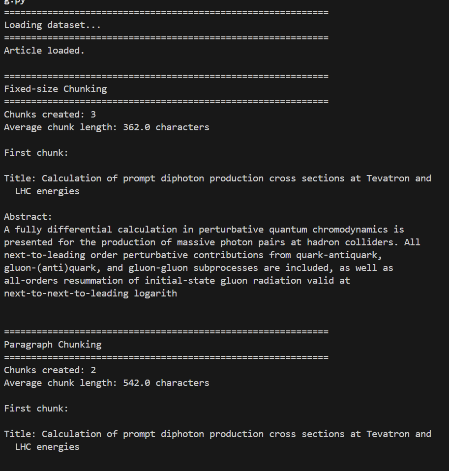
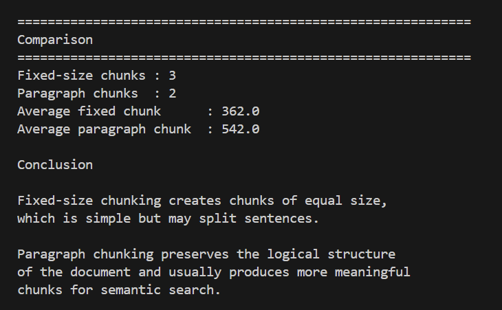

# NoSQL Assignment 2 — Semantic Search for Scientific Articles

## Student

**Name:** Oleksandra Dembitska

**Course:** NoSQL & Vector Databases

---

# Project Overview

The objective of this project is to build a semantic search engine for scientific articles using modern vector databases and embedding models.

Unlike traditional keyword-based search systems, semantic search retrieves documents according to their meaning rather than exact word matches. This enables users to find relevant scientific papers even when different terminology is used.

The project implements the complete semantic retrieval pipeline:

- preparation of the arXiv dataset;
- generation of dense vector embeddings;
- storage of embeddings in Pinecone;
- semantic search;
- semantic search with metadata filtering;
- comparison of chunking strategies;
- implementation of Hybrid Search using BM25 and Reciprocal Rank Fusion (RRF).

The dataset used in this project is a subset of the **arXiv Metadata Dataset** containing **5000 scientific papers**.

---

# Technologies

The following technologies were used during the implementation.

| Technology | Purpose |
|------------|---------|
| Python 3 | Main programming language |
| Pandas | Data processing |
| NumPy | Vector operations |
| Sentence Transformers | Embedding generation |
| HuggingFace | Pre-trained embedding models |
| Pinecone | Vector database |
| rank-bm25 | Keyword search |
| python-dotenv | Environment variables |
| VS Code | Development environment |

---

# Repository Structure

```text
.
├── .env
├── .gitignore
├── requirements.txt
├── README.md
│
├── data
│   └── arxiv_subset.parquet
│
├── embeddings
│   └── embeddings.npy
│
├── scripts
│   ├── 01_prepare_data.py
│   ├── 02_embed.py
│   ├── 03_load_to_pinecone.py
│   ├── 04_search.py
│   ├── 05_chunking.py
│   └── 06_hybrid_search.py
│
└── screenshots
```

---

# Installation

Install all project dependencies.

```bash
pip install -r requirements.txt
```

Create the environment configuration file.

```env
PINECONE_API_KEY=YOUR_API_KEY
PINECONE_INDEX=arxiv-search
```

---

# Dataset Description

The project uses the **arXiv Metadata Dataset**, which contains scientific publications from multiple research fields.

Each record includes:

- title;
- abstract;
- authors;
- publication date;
- scientific category.

For this assignment only the first **5000 papers** were selected, which is sufficient for building and evaluating the semantic search system.

---

# Part 1 — Dataset Preparation

## Objective

The first stage prepares the raw dataset for further processing.

The original arXiv dataset is distributed as a large JSONL file containing metadata for scientific papers. Before generating embeddings, the data must be cleaned and converted into a more efficient storage format.

---

## Running the Script

```bash
python scripts/01_prepare_data.py
```

---

## What the Script Does

The script performs the following operations:

- reads the original JSONL dataset;
- selects the first 5000 papers;
- removes missing values;
- combines article title and abstract into one text field;
- saves the processed dataset as a Parquet file.

The resulting dataset is stored as:

```text
data/arxiv_subset.parquet
```

---

## Why was Parquet chosen instead of JSON?

Parquet is a **column-oriented binary storage format** designed for analytical workloads.

Compared to JSON:

- occupies significantly less disk space;
- loads much faster;
- supports efficient column selection;
- is widely used in modern data engineering pipelines.

Since subsequent scripts repeatedly load the dataset, using Parquet considerably improves performance.

---

## Why combine the title and abstract?

Semantic embedding models perform better when they receive sufficient textual context.

Using only the title would provide very limited semantic information.

Using only the abstract would ignore important keywords contained in the title.

Therefore, the title and abstract were concatenated into a single field called **text**, allowing the embedding model to capture the complete meaning of each paper.

---

## Why clean the dataset before embedding?

Generating embeddings for incomplete documents may lead to poor semantic representations.

Data cleaning removes:

- missing titles;
- missing abstracts;
- invalid records.

As a result, every generated embedding represents a complete scientific document.

---

## Output

After executing the script, a cleaned Parquet dataset is produced.

### Screenshot


---

# Part 2 — Embedding Generation

## Objective

The second stage converts every scientific article into a dense numerical vector.

These vectors are called **embeddings**.

Embeddings capture semantic relationships between documents and enable similarity search.

---

## Running the Script

```bash
python scripts/02_embed.py
```

---

## Embedding Model

The project uses:

```text
sentence-transformers/all-mpnet-base-v2
```

Each article is encoded into a **768-dimensional vector**.

All vectors are stored in:

```text
embeddings/embeddings.npy
```

---

## Why are embeddings necessary?

Traditional search compares documents using keywords.

Embeddings instead represent the **meaning** of the text.

Documents discussing similar concepts become close to each other in vector space, even if different terminology is used.

For example:

Document A:

> Deep learning for image recognition

Document B:

> Neural networks for visual classification

Although these documents contain different words, their embeddings are very similar because they describe the same concept.

---

## Why use Transformer embeddings?

Transformer models understand context rather than isolated words.

Compared to classical methods such as TF-IDF:

| TF-IDF | Transformer Embeddings |
|--------|------------------------|
| Keyword matching | Semantic understanding |
| Sparse vectors | Dense vectors |
| Cannot understand synonyms | Understands semantic similarity |
| Limited context | Uses full sentence context |

Therefore, transformer embeddings are much more suitable for semantic retrieval.

---

## Why was all-mpnet-base-v2 used?

The assignment originally recommends the **SPECTER2** model because it is specifically trained on scientific publications.

However, during implementation compatibility issues were encountered between the latest versions of **SentenceTransformers** and the **PEFT** library.

To ensure a stable and reproducible implementation, the project uses **sentence-transformers/all-mpnet-base-v2**, which provides high-quality sentence embeddings and is widely used for semantic search tasks.

Although it is a general-purpose embedding model, it produces excellent retrieval quality for scientific abstracts.

---

## Output

After successful execution:

- 5000 embeddings are generated;
- embedding dimension equals **768**;
- vectors are saved into a NumPy array.

### Screenshot


---

## Intermediate Conclusion

After completing Parts 1 and 2, the project contains a cleaned dataset together with high-quality vector representations of every scientific paper.

These embeddings serve as the foundation for all subsequent semantic search tasks.

---

# Part 3 — Loading Embeddings into Pinecone

## Objective

After generating embeddings, they must be stored in a vector database to enable efficient semantic search.

For this project **Pinecone** was selected because it provides fast Approximate Nearest Neighbor (ANN) search, metadata filtering and scalable vector indexing.

---

## Running the Script

```bash
python scripts/03_load_to_pinecone.py
```

---

## What the Script Does

The script performs the following operations:

1. Loads the processed dataset.
2. Loads the generated embeddings.
3. Connects to the Pinecone vector database.
4. Creates vector records consisting of:
   - document ID;
   - embedding vector;
   - metadata.
5. Uploads all vectors into the Pinecone index.

Each uploaded vector contains metadata:

- title;
- authors;
- category;
- publication date.

Metadata makes the retrieved search results understandable for users and enables metadata filtering.

---

## Why Use a Vector Database?

Traditional databases search using exact values.

Vector databases search by **similarity**.

Instead of asking:

> "Does this document contain this word?"

Vector databases ask:

> "Which documents are semantically closest to this query?"

This makes them ideal for semantic retrieval.

---

## Why Pinecone?

Pinecone was selected because it offers:

- managed cloud infrastructure;
- high-performance vector indexing;
- Approximate Nearest Neighbor search;
- metadata filtering;
- scalability.

Unlike storing vectors inside a relational database, Pinecone is specifically optimized for similarity search in high-dimensional vector spaces.

---

## Why Store Metadata?

Embeddings themselves only contain numerical values.

Without metadata, the system could only return vector IDs.

Metadata provides meaningful information for each retrieved document:

- paper title;
- authors;
- category;
- publication date.

It also enables filtering during semantic search.

For example:

- return only Machine Learning papers;
- return only Physics papers;
- filter by publication year.

---

## Output

The upload process creates a Pinecone vector index containing all generated embeddings.

### Pinecone Index


---

### Upload Process


---

### Stored Vectors


---

# Part 4 — Semantic Search

## Objective

The purpose of this stage is to retrieve scientific papers according to their semantic meaning rather than exact keyword matching.

Unlike traditional search engines, semantic retrieval converts the user query into an embedding and searches for the most similar vectors inside Pinecone.

---

## Running the Script

```bash
python scripts/04_search.py
```

---

## Task 1 — Semantic Search

Query:

```text
deep learning for image classification
```

The query is converted into a vector embedding.

Pinecone compares this embedding against all stored document vectors using cosine similarity.

The system returns the most semantically similar scientific papers.

### Result


---

## Task 2 — Semantic Search with Metadata Filter

Query:

```text
neural networks
```

Additional filter:

```text
Category = cs.LG
```

Only Machine Learning papers are returned.

This demonstrates that Pinecone can combine semantic similarity with structured metadata filtering.

### Result


---

## Task 3 — Another Semantic Query

Query:

```text
quantum computing algorithms
```

The retrieved documents belong to the quantum computing domain, demonstrating that semantic retrieval works across different research fields.

### Result


---

# Theory

## What is Semantic Search?

Semantic Search retrieves documents according to their meaning.

Instead of matching words, it compares vector embeddings.

Documents discussing similar concepts are retrieved even when they use different vocabulary.

---

## Full-text Search vs Semantic Search

| Full-text Search | Semantic Search |
|-----------------|-----------------|
| Matches keywords | Matches meaning |
| Requires exact words | Understands context |
| Sensitive to synonyms | Robust to synonyms |
| Uses token overlap | Uses embeddings |

Example:

Query:

> Deep learning for image classification

A Full-text Search system may fail to retrieve documents using the phrase:

> Neural architectures for visual recognition

because the exact keywords differ.

Semantic Search retrieves these documents because they describe the same concept.

---

## Cosine Similarity

Cosine Similarity measures the angle between two vectors.

Only the vector direction matters.

Vector magnitude is ignored.

For sentence embeddings this is desirable because semantic meaning depends on direction rather than vector length.

---

## Dot Product

Dot Product considers both:

- direction;
- magnitude.

As a result, longer vectors may receive higher similarity scores even if their semantic meaning is not significantly closer.

---

## Why Was Cosine Similarity Used?

Cosine Similarity is the standard similarity metric for semantic embeddings.

Advantages:

- stable ranking;
- robust semantic comparison;
- independent of vector magnitude.

Therefore, it is the preferred metric for sentence embeddings generated by transformer models.

---

## Intermediate Conclusion

At this stage the project successfully demonstrates semantic retrieval using Pinecone.

Unlike keyword search, documents are retrieved according to semantic similarity, while metadata filtering further improves search precision.


---

# Part 5 — Chunking Strategies

## Objective

Large Language Models and embedding models have a limited context window, meaning they cannot effectively process very long documents at once.

To overcome this limitation, documents are divided into smaller pieces called **chunks** before generating embeddings.

The goal of this part is to compare different chunking strategies and understand how they affect semantic search quality.

---

## Running the Script

```bash
python scripts/05_chunking.py
```

---

## Fixed-size Chunking

The first strategy divides a document into chunks of approximately equal size.

Advantages:

- simple implementation;
- predictable chunk length;
- efficient preprocessing.

Disadvantages:

- may split sentences in the middle;
- logical context can be broken;
- semantic meaning may be partially lost.

### Result



---

## Chunking Comparison

The script compares:

- number of generated chunks;
- average chunk length;
- quality of the produced chunks.

The experiment showed that paragraph-based chunking creates fewer but larger chunks, while fixed-size chunking generates more equally sized fragments.

### Result



---

## Why is Chunking Important?

Embedding models have a limited input size.

If a document is too large:

- part of the information may be truncated;
- embeddings become less informative;
- search quality decreases.

Chunking allows large documents to be indexed while preserving their semantic meaning.

For scientific papers, paragraph-based chunking usually produces more meaningful embeddings because it preserves the logical structure of the document.

---

# Part 6 — Hybrid Search

## Objective

Semantic search is very powerful, but keyword search is still useful when users search for exact terminology.

Hybrid Search combines both approaches in order to improve retrieval quality.

The implementation consists of three stages:

1. BM25 keyword search;
2. Vector search using Pinecone;
3. Reciprocal Rank Fusion (RRF).

---

## Running the Script

```bash
python scripts/06_hybrid_search.py
```

---

## BM25 Search

BM25 ranks documents according to keyword frequency and document statistics.

It performs well when the user query contains exact scientific terminology.

### Result


---

## Vector Search

The same query is converted into an embedding.

Pinecone compares this embedding with all stored vectors and returns the most semantically similar papers.

Unlike BM25, vector search retrieves documents according to their meaning rather than exact keywords.

### Result


---

## Hybrid Search (RRF)

Finally, the results produced by BM25 and Vector Search are combined using **Reciprocal Rank Fusion (RRF)**.

Documents that receive high rankings in both methods appear at the top of the final ranking.

### Result


---

# Theory

## What is BM25?

BM25 is one of the most widely used keyword ranking algorithms in Information Retrieval.

It ranks documents according to:

- keyword frequency;
- inverse document frequency (IDF);
- document length normalization.

Advantages:

- fast;
- interpretable;
- excellent keyword matching.

Limitations:

- does not understand semantic meaning;
- sensitive to wording.

---

## What is Vector Search?

Vector Search compares embeddings rather than keywords.

Instead of matching words, it measures semantic similarity between vectors.

Advantages:

- understands context;
- handles synonyms;
- retrieves conceptually similar documents.

Limitations:

- exact keyword importance may be reduced.

---

## What is Hybrid Search?

Hybrid Search combines keyword-based retrieval and semantic retrieval.

The goal is to benefit from the strengths of both approaches.

In this project, Hybrid Search combines:

- BM25;
- Pinecone Vector Search.

---

## What is Reciprocal Rank Fusion (RRF)?

Reciprocal Rank Fusion combines multiple ranked lists into one final ranking.

Instead of combining similarity scores, RRF combines document positions.

Documents that appear near the top of several rankings receive higher final scores.

This makes Hybrid Search more robust than using BM25 or Vector Search independently.

---

# Comparison of Search Methods

| Method | Advantages | Limitations |
|---------|------------|-------------|
| BM25 | Excellent keyword matching | Cannot understand semantic meaning |
| Vector Search | Finds semantically related documents | May ignore exact keywords |
| Hybrid Search | Combines lexical and semantic relevance | Slightly more computationally expensive |

---

# Conclusion

During this project:

- the arXiv dataset was prepared and cleaned;
- dense vector embeddings were generated using a Transformer model;
- embeddings were stored in Pinecone;
- semantic search with metadata filtering was implemented;
- chunking strategies were compared;
- BM25 keyword search was implemented;
- Hybrid Search using Reciprocal Rank Fusion (RRF) was developed.

The experiments demonstrate that semantic search retrieves documents according to their meaning rather than exact wording, while Hybrid Search provides the most balanced retrieval quality by combining lexical and semantic relevance.

Overall, this project illustrates how modern embedding models and vector databases can significantly improve information retrieval compared to traditional keyword-based search.