# NoSQL Assignment 2 — Semantic Search for Scientific Articles

## Student

**Name:** Oleksandra Dembitska

**Course:** NoSQL & Vector Databases

---

# Project Overview

The objective of this project is to build a semantic search engine for scientific articles using modern vector databases and embedding models.

Unlike traditional keyword-based search systems, semantic search retrieves documents according to their meaning rather than exact word matches. This enables users to find relevant scientific papers even when different terminology is used.

The project implements the complete semantic retrieval pipeline:

- preparation of the arXiv dataset;
- generation of dense vector embeddings;
- storage of embeddings in Pinecone;
- semantic search;
- semantic search with metadata filtering;
- comparison of chunking strategies;
- implementation of Hybrid Search using BM25 and Reciprocal Rank Fusion (RRF).

The dataset used in this project is a subset of the **arXiv Metadata Dataset** containing **5000 scientific papers**.

---

# Technologies

The following technologies were used during the implementation.

| Technology | Purpose |
|------------|---------|
| Python 3 | Main programming language |
| Pandas | Data processing |
| NumPy | Vector operations |
| Sentence Transformers | Embedding generation |
| HuggingFace | Pre-trained embedding models |
| Pinecone | Vector database |
| rank-bm25 | Keyword search |
| python-dotenv | Environment variables |
| VS Code | Development environment |

---

# Repository Structure

```text
.
├── .env
├── .gitignore
├── requirements.txt
├── README.md
│
├── data
│   └── arxiv_subset.parquet
│
├── embeddings
│   └── embeddings.npy
│
├── scripts
│   ├── 01_prepare_data.py
│   ├── 02_embed.py
│   ├── 03_load_to_pinecone.py
│   ├── 04_search.py
│   ├── 05_chunking.py
│   └── 06_hybrid_search.py
│
└── screenshots
```

---

# Installation

Install all project dependencies.

```bash
pip install -r requirements.txt
```

Create the environment configuration file.

```env
PINECONE_API_KEY=YOUR_API_KEY
PINECONE_INDEX=arxiv-search
```

---

# Dataset Description

The project uses the **arXiv Metadata Dataset**, which contains scientific publications from multiple research fields.

Each record includes:

- title;
- abstract;
- authors;
- publication date;
- scientific category.

For this assignment only the first **5000 papers** were selected, which is sufficient for building and evaluating the semantic search system.

---

# Part 1 — Dataset Preparation

## Objective

The first stage prepares the raw arXiv dataset for semantic search by cleaning the data, selecting the required fields, and converting it into an efficient storage format suitable for repeated processing.

The original arXiv dataset is distributed as a large JSONL file containing metadata for scientific papers. Before generating embeddings, the data must be cleaned and converted into a more efficient storage format.

---

## Running the Script

```bash
python scripts/01_prepare_data.py
```

---

## What the Script Does

The script performs the following operations:

- reads the original JSONL dataset;
- selects the first 5000 papers;
- removes missing values;
- combines article title and abstract into one text field;
- saves the processed dataset as a Parquet file.

The resulting dataset is stored as:

```text
data/arxiv_subset.parquet
```

---

## Why was Parquet chosen instead of JSON?

Parquet is a **column-oriented binary storage format** designed for analytical workloads.

Compared to JSON:

- occupies significantly less disk space;
- loads much faster;
- supports efficient column selection;
- is widely used in modern data engineering pipelines.

Since subsequent scripts repeatedly load the dataset, using Parquet considerably improves performance.

---

## Why combine the title and abstract?

Semantic embedding models perform better when they receive sufficient textual context.

Using only the title would provide very limited semantic information.

Using only the abstract would ignore important keywords contained in the title.

Therefore, the title and abstract were concatenated into a single field called **text**, allowing the embedding model to capture the complete meaning of each paper.

---

## Why clean the dataset before embedding?

Generating embeddings for incomplete documents may lead to poor semantic representations.

Data cleaning removes:

- missing titles;
- missing abstracts;
- invalid records.

As a result, every generated embedding represents a complete scientific document.

---

## Output

After executing the script, a cleaned Parquet dataset is produced.

### Screenshot

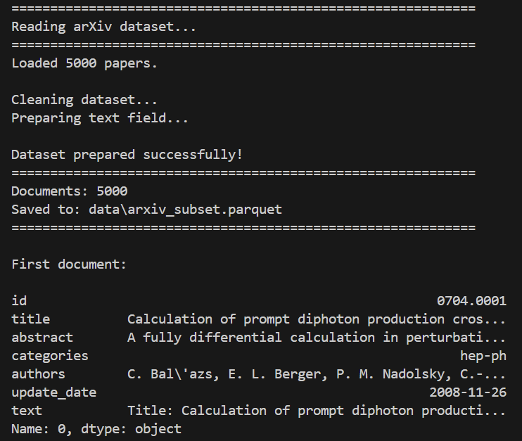

---

# Part 2 — Embedding Generation

## Objective

The second stage converts every scientific article into a dense numerical vector.

These vectors are called **embeddings**.

Embeddings capture semantic relationships between documents and enable similarity search.

---

## Running the Script

```bash
python scripts/02_embed.py
```

---

## Embedding Model

The project uses:

```text
sentence-transformers/all-mpnet-base-v2
```

Each article is encoded into a **768-dimensional vector**.

All vectors are stored in:

```text
embeddings/embeddings.npy
```

---

## Why are embeddings necessary?

Traditional search compares documents using keywords.

Embeddings instead represent the **meaning** of the text.

Documents discussing similar concepts become close to each other in vector space, even if different terminology is used.

For example:

Document A:

> Deep learning for image recognition

Document B:

> Neural networks for visual classification

Although these documents contain different words, their embeddings are very similar because they describe the same concept.

---

## Why use Transformer embeddings?

Transformer models understand context rather than isolated words.

Compared to classical methods such as TF-IDF:

| TF-IDF | Transformer Embeddings |
|--------|------------------------|
| Keyword matching | Semantic understanding |
| Sparse vectors | Dense vectors |
| Cannot understand synonyms | Understands semantic similarity |
| Limited context | Uses full sentence context |

Therefore, transformer embeddings are much more suitable for semantic retrieval.

---

## Why was all-mpnet-base-v2 used?

The assignment originally recommends the **SPECTER2** model because it is specifically trained on scientific publications.

However, during implementation compatibility issues were encountered between the latest versions of **SentenceTransformers** and the **PEFT** library.

To ensure a stable and reproducible implementation, the project uses **sentence-transformers/all-mpnet-base-v2**, which provides high-quality sentence embeddings and is widely used for semantic search tasks.

Although it is a general-purpose embedding model, it produces excellent retrieval quality for scientific abstracts.

---
## Why is SPECTER2 Recommended for Scientific Literature?

SPECTER2 is specifically trained on scientific publications and citation relationships. Unlike general-purpose sentence embedding models, it learns semantic representations that capture the relationships between research papers.

As a result, papers discussing similar scientific topics are placed closer together in the embedding space, even when they use different terminology.

For this assignment, the original recommendation was to use SPECTER2. However, due to compatibility issues between the available SentenceTransformers and PEFT versions, the implementation uses sentence-transformers/all-mpnet-base-v2 instead.

Although all-mpnet-base-v2 is a general-purpose embedding model, it produces high-quality semantic embeddings and performed well for scientific abstracts in this project.
---

## Output

After successful execution:

- 5000 embeddings are generated;
- embedding dimension equals **768**;
- vectors are saved into a NumPy array.

### Screenshot

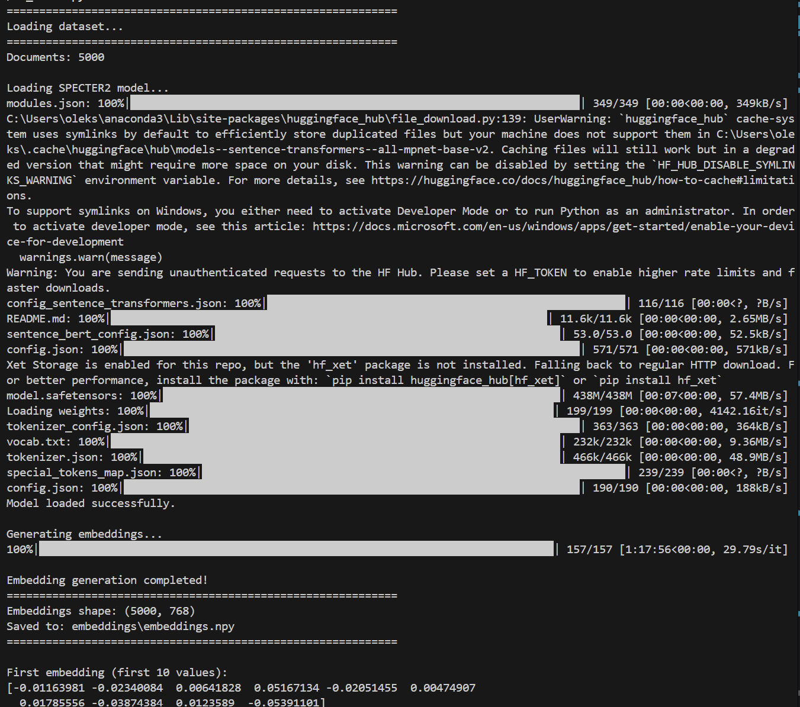

---

## Intermediate Conclusion

After completing Parts 1 and 2, the project contains a cleaned dataset together with high-quality vector representations of every scientific paper.

These embeddings serve as the foundation for all subsequent semantic search tasks.

---

# Part 3 — Loading Embeddings into Pinecone

## Objective

After generating embeddings, they must be stored in a vector database to enable efficient semantic search.

For this project, **Pinecone** was selected because it provides fast Approximate Nearest Neighbor (ANN) search, metadata filtering, and scalable vector indexing.

---

## Running the Script

```bash
python scripts/03_load_to_pinecone.py
```

---

## What the Script Does

The script performs the following operations:

1. Loads the processed dataset.
2. Loads the generated embeddings.
3. Connects to the Pinecone vector database.
4. Creates vector records consisting of:
   - unique document identifier;
   - 768-dimensional embedding vector;
   - document metadata.
5. Uploads all vectors into the Pinecone index.

Each uploaded vector contains the following metadata:

- title;
- authors;
- category;
- publication date.

Metadata makes the retrieved search results understandable for users and enables metadata filtering during semantic search.

---

## Why Use a Vector Database?

Traditional databases search using exact values or keywords.

Vector databases search by **semantic similarity**.

Instead of asking:

> "Does this document contain this word?"

a vector database asks:

> "Which documents are semantically closest to this query?"

This enables the retrieval of relevant documents even when different terminology is used, making vector databases ideal for semantic search applications.

---

## Why Pinecone?

Pinecone was selected because it provides:

- fully managed cloud infrastructure;
- high-performance vector indexing;
- Approximate Nearest Neighbor (ANN) search;
- metadata filtering;
- automatic scalability.

Unlike storing vectors inside a relational database, Pinecone is specifically optimized for high-dimensional similarity search, allowing efficient retrieval even for very large collections of vectors.

---

## Pinecone vs. Qdrant vs. Chroma

Several vector databases are available for semantic search applications.

| Database | Advantages | Disadvantages |
|-----------|------------|---------------|
| **Pinecone** | Fully managed cloud service, automatic scaling, fast ANN search, metadata filtering | Commercial service with usage limits |
| **Qdrant** | Open-source, advanced payload filtering, can be self-hosted | Requires deployment and maintenance |
| **Chroma** | Lightweight, easy to install, ideal for local development and prototyping | Less suitable for large-scale production workloads |

For this assignment, **Pinecone** was selected because it provides a production-ready managed cloud service with efficient vector indexing and built-in similarity search. This allows the implementation to focus on semantic retrieval instead of infrastructure management.

---

## Why Store Metadata?

Embeddings themselves contain only numerical values.

Without metadata, the system would only return vector identifiers, making the search results difficult to interpret.

Metadata provides meaningful information for every retrieved document, including:

- paper title;
- authors;
- scientific category;
- publication date.

In addition, metadata enables structured filtering during semantic search.

For example, users can:

- retrieve only Machine Learning papers;
- retrieve only Physics papers;
- filter publications by year;
- combine metadata filters with semantic similarity.

---

## Output

After executing the script, a Pinecone index containing all scientific paper embeddings is created.

### Pinecone Index


---

### Upload Process

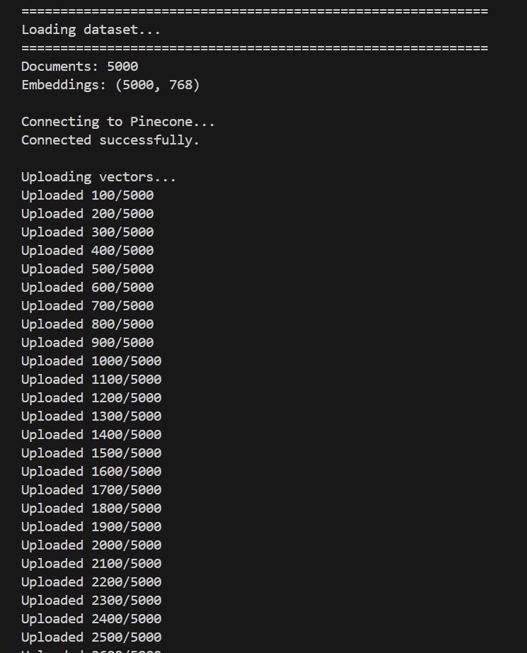

---

### Stored Vectors

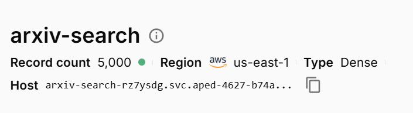

---

## Intermediate Conclusion

At the end of this stage, every scientific paper is represented as a dense vector stored inside Pinecone together with its associated metadata.

The vector database is now ready to support efficient semantic search and metadata-based filtering without scanning the entire dataset.

---

# Part 4 — Semantic Search

## Objective

The purpose of this stage is to retrieve scientific papers according to their semantic meaning rather than exact keyword matching.

Unlike traditional search engines, semantic retrieval converts a user's query into an embedding vector and searches for the most similar document vectors stored in Pinecone.

This part also demonstrates metadata filtering and compares different similarity metrics used for vector retrieval.

---

## Running the Script

```bash
python scripts/04_search.py
```

---

# Task 1 — Basic Semantic Search

### Query

```text
deep learning for image classification
```

The query is encoded into a dense embedding using the same transformer model that was used for the scientific papers.

Pinecone compares the query embedding against all stored vectors using **Cosine Similarity** and returns the most semantically similar documents.

Unlike keyword search, the retrieved papers do not need to contain the exact query words. Instead, they are selected because they describe similar scientific concepts.

### Result

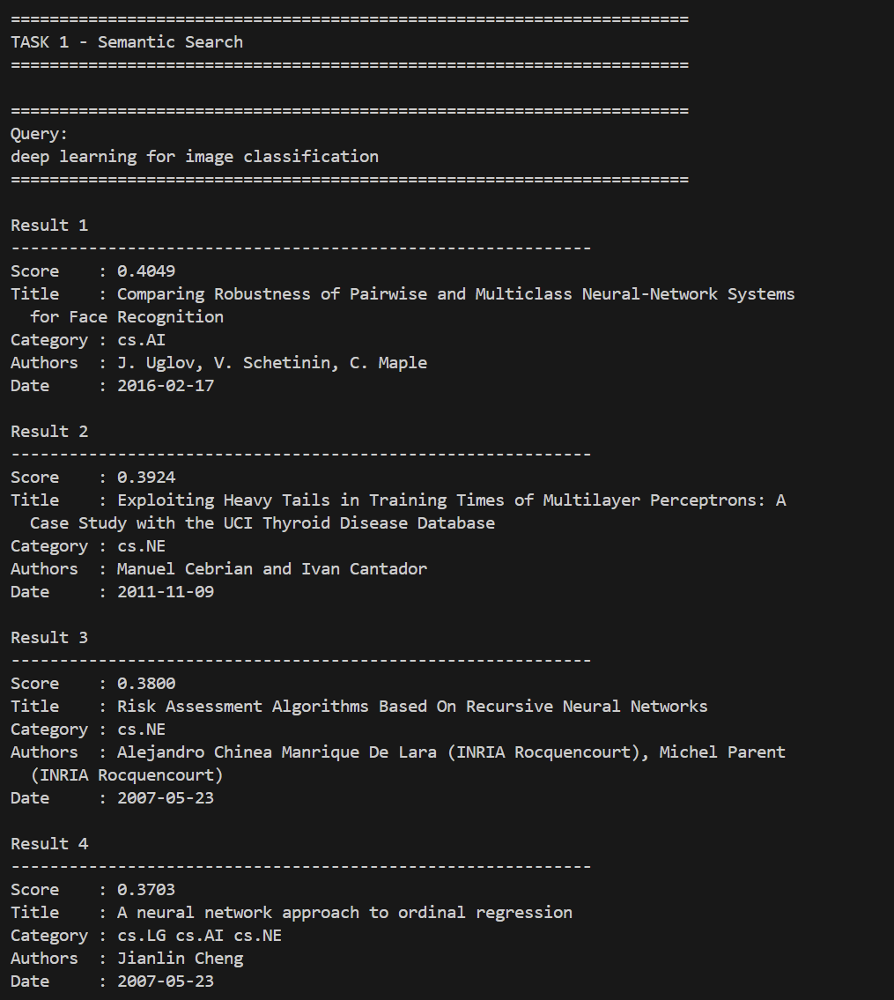

---

# Task 2 — Semantic Search with Metadata Filtering

### Query

```text
neural networks
```

### Filter

```text
Category = cs.LG
```

In addition to semantic similarity, Pinecone supports structured metadata filtering.

Only papers belonging to the **Machine Learning (cs.LG)** category are considered during retrieval.

This demonstrates how semantic search can be combined with traditional database filtering to improve result relevance.

### Result


---

# Task 3 — Second Semantic Query

### Query

```text
quantum computing algorithms
```

A second query was executed to verify that the semantic search system performs well across different research domains.

The retrieved papers belong primarily to the field of quantum computing, showing that the embeddings successfully capture semantic meaning rather than relying on keyword matching.

### Result

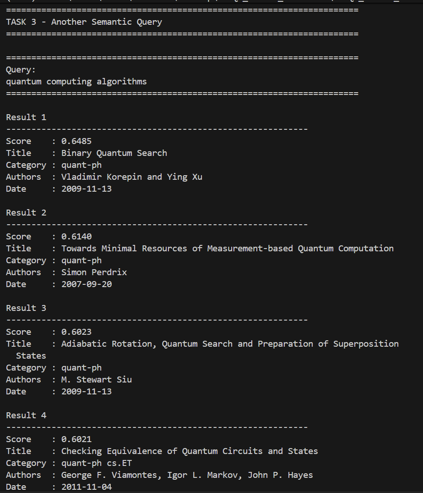

---

# Task 4 — Filtering by Publication Year

Semantic search can also be combined with temporal constraints.

The following example restricts the search to papers published after a specified year while still ranking results according to semantic similarity.

This demonstrates how vector databases can integrate semantic retrieval with structured metadata queries.

### Result

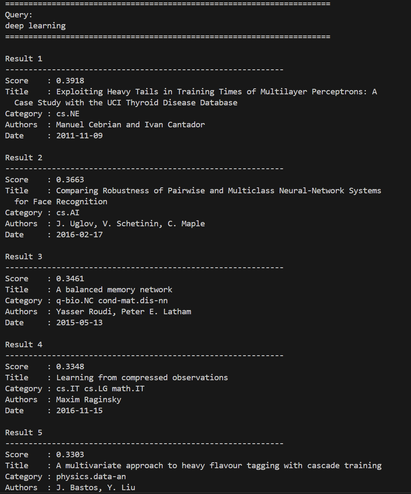

---

# Task 5 — Similarity Metric Comparison

Different similarity metrics can be used when comparing vector embeddings.

The project compares three commonly used metrics:

- Cosine Similarity
- Dot Product
- Euclidean Distance (L2)

Although all three retrieve related documents, the rankings differ slightly depending on how similarity is calculated.

### Result


---

# Theory

## What is Semantic Search?

Semantic Search retrieves documents according to their meaning rather than exact keyword matches.

Instead of comparing words directly, both the query and the documents are represented as dense vector embeddings.

Documents discussing similar concepts are located close to each other in the embedding space, allowing the system to retrieve relevant papers even when different terminology is used.

---

## Full-text Search vs. Semantic Search

| Full-text Search | Semantic Search |
|-----------------|-----------------|
| Matches keywords | Matches meaning |
| Requires exact words | Understands context |
| Sensitive to synonyms | Robust to synonyms |
| Uses token overlap | Uses vector embeddings |

For example, a keyword-based search may fail to retrieve a paper titled:

> Neural architectures for visual recognition

when the query is:

> Deep learning for image classification

because the exact keywords differ.

Semantic search retrieves the paper because both texts describe the same underlying concept.

---

## Similarity Metrics

### Cosine Similarity

Cosine Similarity measures the angle between two vectors while ignoring their magnitude.

It is widely used for sentence embeddings because semantic meaning is primarily represented by vector direction rather than vector length.

---

### Dot Product

Dot Product considers both the angle between vectors and their magnitudes.

For normalized embeddings, Dot Product produces rankings that are very similar to Cosine Similarity.

---

### Euclidean Distance (L2)

Euclidean Distance measures the geometric distance between vectors in the embedding space.

Unlike Cosine Similarity, it is influenced by vector magnitude and therefore may produce different rankings.

---

## Why Do Cosine Similarity and Dot Product Produce Similar Rankings?

The embedding model **sentence-transformers/all-mpnet-base-v2** produces vectors that are approximately normalized.

When vectors have nearly identical magnitudes, the Dot Product becomes almost proportional to Cosine Similarity.

As a result, both metrics generate nearly identical rankings, which is consistent with the experimental results obtained in this project.

Euclidean Distance behaves differently because it measures geometric distance instead of angular similarity.

---

## Why Was Cosine Similarity Used?

Cosine Similarity is considered the standard metric for transformer-based sentence embeddings because it focuses on semantic direction rather than vector magnitude.

Its advantages include:

- robust semantic comparison;
- stable ranking performance;
- reduced sensitivity to vector length;
- widespread adoption in semantic search systems.

For these reasons, Cosine Similarity was selected as the primary similarity metric in this project.

---

## Intermediate Conclusion

This stage demonstrates the effectiveness of semantic search using Pinecone.

Compared with traditional keyword search, semantic retrieval identifies conceptually related scientific papers even when different terminology is used.

The experiments also show that metadata filtering can significantly improve search precision, while the comparison of similarity metrics confirms that Cosine Similarity and Dot Product produce nearly identical rankings for normalized transformer embeddings.
---
# Part 5 — Chunking Strategies

## Objective

Embedding models have a limited context window and cannot efficiently process very long documents in a single pass.

To address this limitation, documents are divided into smaller segments called **chunks** before generating embeddings.

The objective of this part is to compare two chunking strategies by indexing them into separate Pinecone indexes and evaluating their semantic retrieval performance.

---

## Running the Script

```bash
python scripts/05_chunking.py
```

---

## Chunking Strategies

Two chunking strategies were implemented:

### Fixed-size Chunking

The document is divided into equally sized text fragments.

Advantages:

- simple implementation;
- predictable chunk size;
- efficient preprocessing.

Disadvantages:

- sentences may be split;
- logical context can be interrupted;
- semantic meaning may be partially lost.

---

### Paragraph-based Chunking

The document is divided according to paragraph boundaries.

Advantages:

- preserves semantic context;
- maintains logical structure;
- produces more coherent embeddings.

Disadvantages:

- chunk sizes are less uniform;
- preprocessing depends on document formatting.

---

## Chunk Creation

The script generates both chunking strategies for the same scientific paper.

### Result

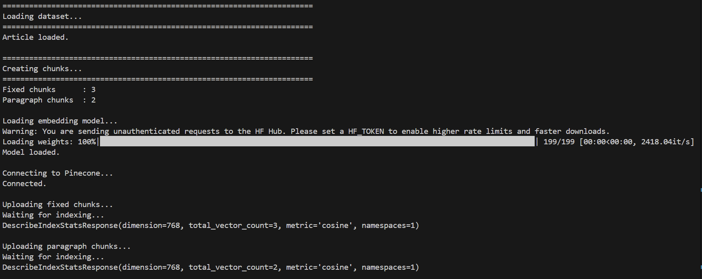

---

## Semantic Search Using Separate Pinecone Indexes

Each chunking strategy is uploaded into its own Pinecone index:

- **arxiv-fixed**
- **arxiv-paragraph**

The same semantic query is executed against both indexes.

### Fixed-size Chunk Search

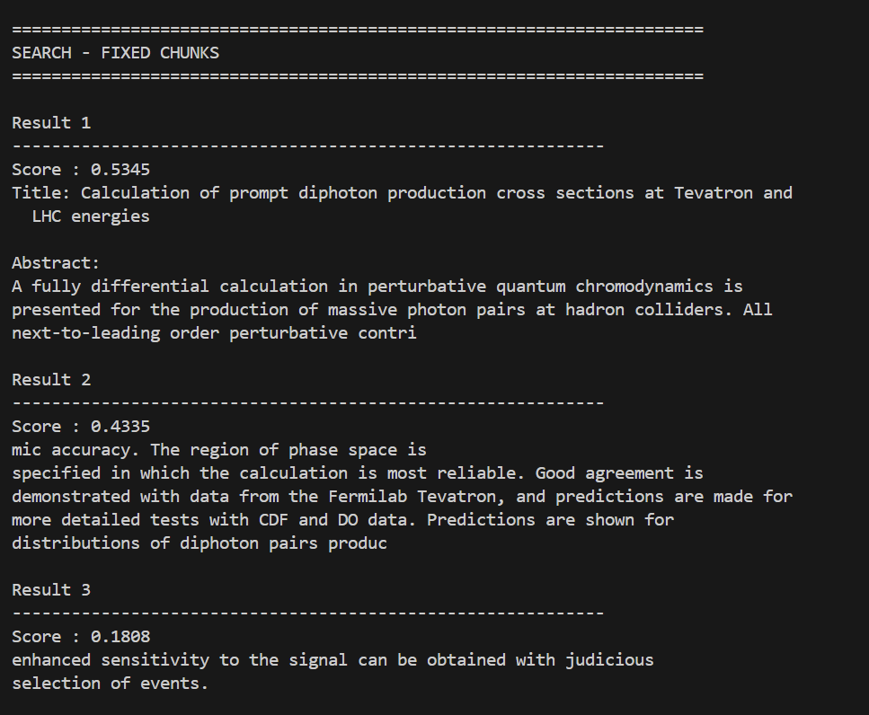

---

### Paragraph-based Chunk Search

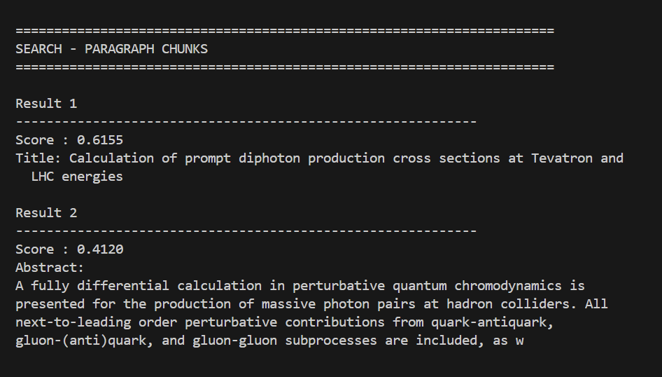

---

## Comparison

The experiment compares:

- number of generated chunks;
- average chunk size;
- semantic retrieval quality.

The results show that paragraph-based chunking generally returns more coherent search results because complete semantic units are preserved.

Fixed-size chunking generates more uniformly sized fragments but may split important contextual information across chunk boundaries.

### Result

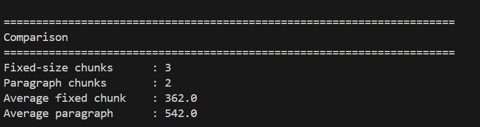

---

## Why is Chunking Important?

Embedding models accept only a limited amount of text.

Without chunking:

- long documents may be truncated;
- important information can be lost;
- embedding quality decreases.

Chunking enables large scientific documents to be indexed while preserving their semantic content.

For scientific literature, paragraph-based chunking is generally preferable because paragraphs usually correspond to complete ideas or research concepts.

---

## Intermediate Conclusion

Both chunking strategies successfully support semantic search.

However, paragraph-based chunking provides more meaningful retrieval results because it preserves the natural structure of scientific documents.

---

# Part 6 — Hybrid Search

## Objective

Semantic search retrieves documents according to meaning, while keyword search remains effective for exact terminology.

Hybrid Search combines both approaches to improve retrieval quality.

The implementation consists of three stages:

1. BM25 keyword search;
2. Pinecone vector search;
3. Reciprocal Rank Fusion (RRF).

---

## Running the Script

```bash
python scripts/06_hybrid_search.py
```

---

## Experimental Queries

Three different queries were evaluated:

```text
deep learning for image classification
```

```text
quantum computing algorithms
```

```text
graph neural networks
```

Testing multiple queries demonstrates that the hybrid approach performs consistently across different scientific domains.

---

## BM25 Search

BM25 ranks documents using lexical similarity based on keyword frequency and inverse document frequency.

It performs particularly well when the query contains exact scientific terminology.

### Result

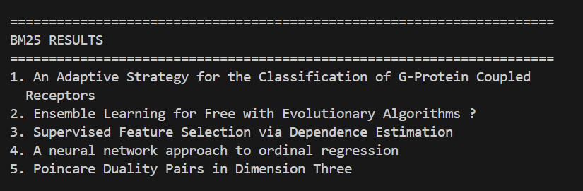

---

## Vector Search

The query is converted into a transformer embedding.

Pinecone retrieves the documents whose embeddings are most similar to the query vector.

Unlike BM25, Vector Search retrieves semantically related papers even when different terminology is used.

### Result

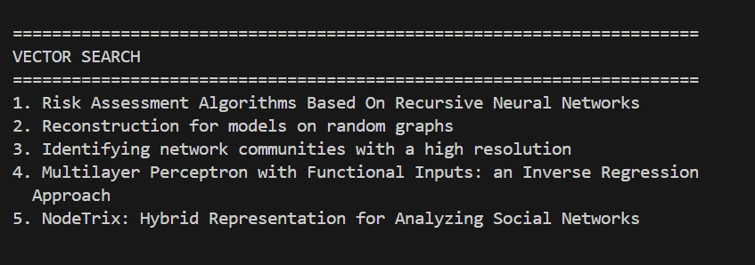

---

## Hybrid Search (RRF)

The rankings produced by BM25 and Vector Search are combined using **Reciprocal Rank Fusion (RRF)**.

Documents that receive high rankings from both methods are promoted to the top of the final ranking.

### Result

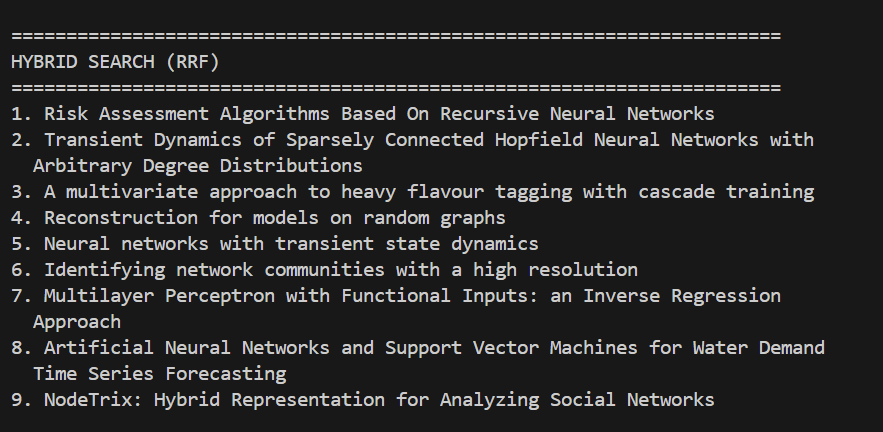

---

## Comparison of Retrieval Methods

The implementation compares the rankings produced by all three retrieval approaches.

### Result

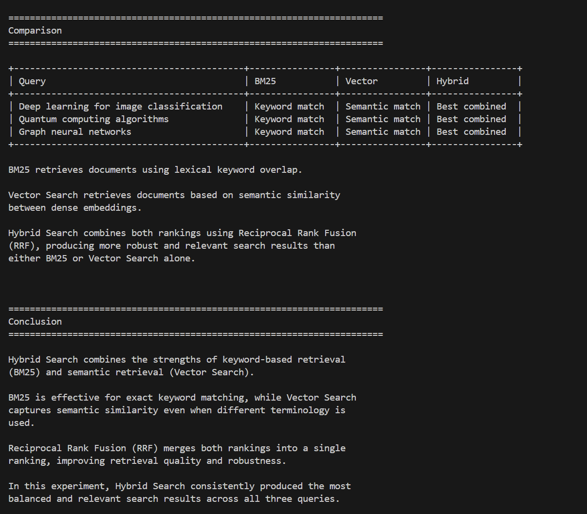

---

# Theory

## What is BM25?

BM25 is one of the most widely used ranking algorithms in Information Retrieval.

It ranks documents according to:

- keyword frequency;
- inverse document frequency (IDF);
- document length normalization.

Advantages:

- efficient keyword matching;
- interpretable ranking;
- computationally efficient.

Limitations:

- cannot understand semantic meaning;
- sensitive to wording and synonyms.

---

## What is Vector Search?

Vector Search compares dense embeddings rather than keywords.

Instead of matching words directly, it retrieves documents according to semantic similarity.

Advantages:

- understands context;
- handles synonyms;
- retrieves conceptually related documents.

Limitations:

- exact keyword importance may be reduced.

---

## What is Hybrid Search?

Hybrid Search combines lexical retrieval with semantic retrieval.

In this project, Hybrid Search merges:

- BM25 keyword search;
- Pinecone vector search.

The goal is to benefit from both exact keyword matching and semantic understanding.

---

## What is Reciprocal Rank Fusion (RRF)?

Reciprocal Rank Fusion (RRF) combines multiple ranked lists into a single ranking.

Instead of combining similarity scores, RRF combines document positions.

Documents that consistently appear near the top of multiple rankings receive higher final scores.

This produces more robust retrieval performance than relying on either BM25 or Vector Search individually.

---

# Comparison of Search Methods

| Method | Advantages | Limitations |
|---------|------------|-------------|
| BM25 | Excellent keyword matching | Cannot capture semantic meaning |
| Vector Search | Retrieves semantically related documents | Exact keyword matching may be weaker |
| Hybrid Search | Combines lexical and semantic relevance | Slightly higher computational cost |

---

# Final Conclusion

This project demonstrates a complete semantic search pipeline for scientific literature.

The workflow includes dataset preparation, embedding generation, vector indexing in Pinecone, semantic retrieval, metadata filtering, chunking strategies, and Hybrid Search using Reciprocal Rank Fusion.

The experiments show that semantic search retrieves scientifically related papers more effectively than traditional keyword-based methods. Metadata filtering further improves retrieval precision, while paragraph-based chunking preserves document context more effectively than fixed-size chunking.

Finally, Hybrid Search provides the most balanced retrieval performance by combining the strengths of lexical matching (BM25) and semantic similarity, making it the most effective approach among the evaluated retrieval methods.