# Assignment 3 — Graph Knowledge for Recommendation System using Neo4j

## Student

**Oleksandra Dembitska**

Course: NoSQL Databases

---

# Project Overview

The purpose of this assignment is to design and implement a graph-based movie recommendation system using the MovieLens 1M dataset and Neo4j.

The project covers the complete workflow of building a graph database:

- designing an appropriate graph schema;
- converting the original dataset into CSV format;
- importing data into Neo4j;
- writing Cypher queries of different complexity;
- identifying graph supernodes;
- applying Graph Data Science algorithms;
- analyzing the advantages of graph databases compared to relational databases.

The implementation uses both Neo4j AuraDB Free and Neo4j Desktop. AuraDB was sufficient for loading and querying the data, while Neo4j Desktop was used to execute Graph Data Science algorithms because of the storage and memory limitations of the free AuraDB tier.

---

# Technologies

- Neo4j Desktop
- Neo4j AuraDB Free
- Graph Data Science Library (GDS)
- APOC Procedures
- Python 3
- Cypher Query Language

---

# Dataset

The project uses the **MovieLens 1M** dataset.

Original files:

- movies.dat
- users.dat
- ratings.dat

Before importing into Neo4j the dataset was converted into UTF-8 CSV format using a Python script (`convert.py`).

Generated files:

- movies.csv
- users.csv
- ratings.csv

---

# Project Structure

```
Dembitska_nosql_3/
│
├── data/
│   ├── movies.dat
│   ├── ratings.dat
│   └── users.dat
│
├── import/
│   ├── movies.csv
│   ├── ratings.csv
│   └── users.csv
│
├── queries/
│   ├── part2_load.cypher
│   ├── part3_queries.cypher
│   ├── part4_supernodes.cypher
│   └── part5_gds.cypher
│
├── screenshots/
│
├── convert.py
├── requirements.txt
└── README.md
```

---

# Part 1 — Graph Schema Design

Before importing the MovieLens dataset into Neo4j, an appropriate graph schema was designed. Since the dataset mainly describes relationships between users and movies, the **Property Graph Model** is a natural choice. The selected schema minimizes traversal complexity, reduces data duplication, and provides efficient execution of recommendation queries.

## Graph Schema

```text
              +----------------------+
              |        User          |
              |----------------------|
              | userId               |
              | gender               |
              | age                  |
              | occupation           |
              +----------------------+
                        |
                        | RATED
                        | rating
                        | timestamp
                        v
              +----------------------+
              |        Movie         |
              |----------------------|
              | movieId              |
              | title                |
              | year                 |
              +----------------------+
                        |
                        | HAS_GENRE
                        v
              +----------------------+
              |        Genre         |
              |----------------------|
              | name                 |
              +----------------------+
```

If available, the generated Neo4j schema visualization is shown below.


---

## Graph Nodes

### User

**Properties**

- `userId`
- `gender`
- `age`
- `occupation`

Each **User** node represents one MovieLens user.

### Movie

**Properties**

- `movieId`
- `title`
- `year`

Each **Movie** node exists only once regardless of how many ratings it receives.

### Genre

**Properties**

- `name`

Each **Genre** node is shared among all movies belonging to that genre.

---

## Graph Relationships

### RATED

```text
(User)-[:RATED {rating, timestamp}]->(Movie)
```

Properties:

- `rating`
- `timestamp`

Each relationship stores one user's rating for one movie.

### HAS_GENRE

```text
(Movie)-[:HAS_GENRE]->(Genre)
```

Each movie is connected to one or more genres.

---

# Question 1

## Which entities became nodes and which became relationships? Why?

The graph contains three node types:

- **User**
- **Movie**
- **Genre**

These entities have their own attributes and exist independently from one another.

Ratings were modeled as **relationships** because they describe an interaction between exactly one user and one movie. A rating has no meaning without both endpoints, making it a natural edge in the graph.

This design keeps the graph compact and allows recommendation queries to traverse directly from users to movies without introducing additional intermediate nodes.

---

# Question 2

## Why was Rating modeled as a relationship instead of a separate node?

The implemented model is:

```text
(User)-[:RATED]->(Movie)
```

This approach has several advantages:

- fewer nodes in the graph;
- simpler graph traversals;
- faster recommendation queries;
- lower storage requirements.

An alternative design could model ratings as separate nodes:

```text
(User)-[:MADE]->(Rating)-[:FOR]->(Movie)
```

This approach also has advantages:

- ratings become independent entities;
- additional metadata (comments, review text, likes, moderation status, etc.) can easily be attached;
- ratings themselves may participate in other relationships.

However, it also introduces important disadvantages:

- significantly more nodes;
- longer traversal paths;
- more complex Cypher queries;
- lower performance for graph traversals and recommendation algorithms.

Since the MovieLens dataset stores only a numeric rating and a timestamp, representing ratings as relationships is the simplest and most efficient solution.

---

# Question 3

## Why are genres stored as separate nodes instead of a list property?

Genres could be stored as a property inside each movie, for example:

```text
genres = ["Comedy", "Drama"]
```

However, representing genres as separate nodes provides several important advantages.

First, all movies belonging to the same genre become directly connected through a shared **Genre** node, making graph traversals straightforward.

Second, aggregation queries become much simpler, for example:

- number of movies in each genre;
- average rating per genre;
- most popular genres;
- recommendation queries limited to a specific genre.

Finally, Genre nodes can later be extended with additional attributes without modifying the Movie schema.

For these reasons, modeling genres as separate nodes follows graph database best practices and results in a cleaner and more flexible graph model.

---

# Part 2 — Data Loading

The MovieLens dataset was imported into Neo4j after converting the original `.dat` files into UTF-8 CSV format. Since the original dataset uses the `::` delimiter and Latin-1 encoding, a preprocessing step was required before importing the data.

To prevent duplicate records during repeated executions of the import scripts, the `MERGE` clause was used instead of `CREATE` wherever appropriate.

Before importing relationships, uniqueness constraints were created to improve lookup performance and guarantee entity uniqueness.

Because the dataset contains more than one million ratings, the relationship import was performed using `apoc.periodic.iterate()` with batch processing.

The import process consisted of the following steps:

1. Convert the dataset into CSV format.
2. Create uniqueness constraints.
3. Import Movie nodes.
4. Import User nodes.
5. Create Genre nodes and HAS_GENRE relationships.
6. Import RATED relationships.
7. Verify the imported data.

---

## Dataset Conversion

The original MovieLens files use the `::` separator and Latin-1 encoding.

A Python script (`convert.py`) converts them into UTF-8 CSV files before they are imported into Neo4j.

Generated files:

- `movies.csv`
- `users.csv`
- `ratings.csv`

### Screenshot

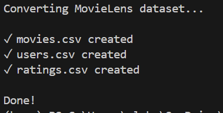

---

## Creating Constraints

Before loading the data, uniqueness constraints were created for the three primary node types:

- Movie
- User
- Genre

These constraints provide several advantages:

- prevent duplicate nodes;
- improve lookup performance;
- accelerate relationship creation.

### Screenshot

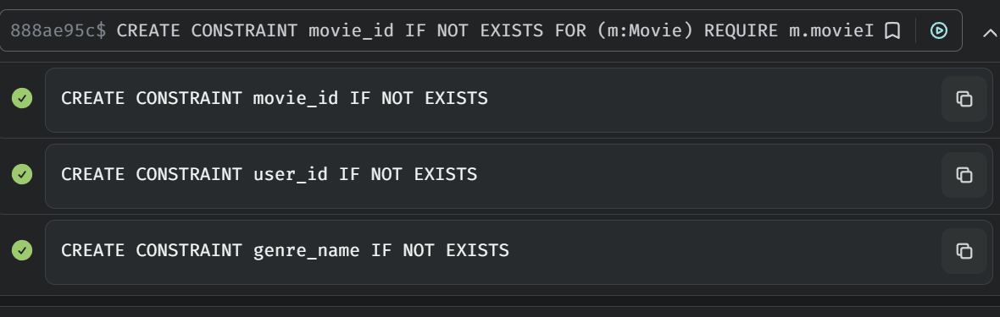

---

## Loading Movie Nodes

Movie information was imported from `movies.csv`.

Each movie was created using the `MERGE` clause, making the import script idempotent and safe to execute multiple times.

Stored properties:

- `movieId`
- `title`

### Screenshot

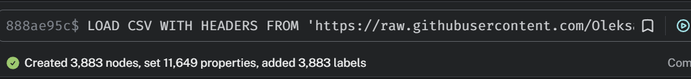

---

## Loading User Nodes

User information was imported from `users.csv`.

Each User node stores:

- `userId`
- `gender`
- `age`
- `occupation`

The `MERGE` clause guarantees that duplicate users cannot be created if the script is executed again.

### Screenshot

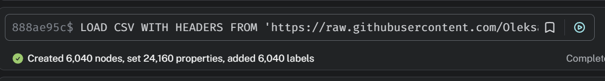

---

## Creating Genre Nodes

Each movie may belong to multiple genres.

Instead of storing genres as a text list inside Movie nodes, individual Genre nodes were created and connected using the relationship

```text
(Movie)-[:HAS_GENRE]->(Genre)
```

This design simplifies traversals and aggregation queries by genre.

### Screenshot

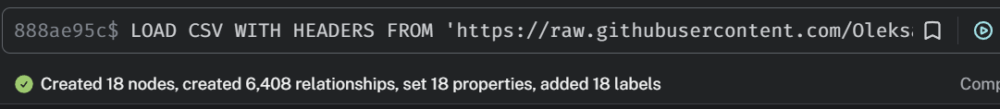

---

## Loading Rating Relationships

Ratings represent interactions between users and movies.

Each rating creates the relationship

```text
(User)-[:RATED {rating, timestamp}]->(Movie)
```

Because the MovieLens dataset contains more than one million ratings, the relationships were imported using `apoc.periodic.iterate()`.

The import was executed in batches (`batchSize: 10000`) with

```cypher
parallel: false
```

Using `parallel: false` avoids possible race conditions when creating or matching graph elements and follows Neo4j best practices for safe batch imports.

### Screenshot


---

## Database Verification

After completing the import, the database was verified by counting:

- Movie nodes;
- User nodes;
- Genre nodes;
- RATED relationships.

The returned counts confirmed that all records were successfully imported into the database.

### Screenshot

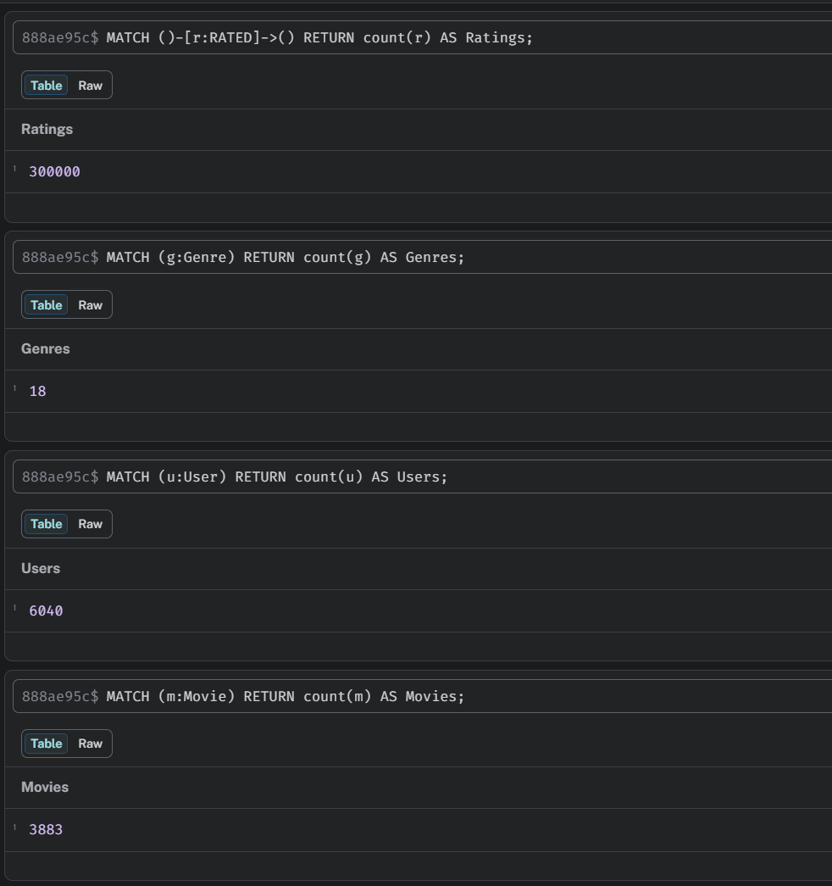

---

# Part 3 — Cypher Queries

This section demonstrates several Cypher queries of increasing complexity, ranging from simple filtering and aggregation to recommendation-oriented graph traversals.

All queries are stored in:

```text
queries/part3_queries.cypher
```

---

## Query 1 — Thriller Movies with High Average Rating

This query finds all **Thriller** movies whose average rating is greater than **4.0**.

The query traverses Movie nodes to Genre nodes through the `HAS_GENRE` relationship and aggregates user ratings stored in `RATED` relationships.

This demonstrates how graph traversals naturally combine filtering and aggregation.

### Screenshot

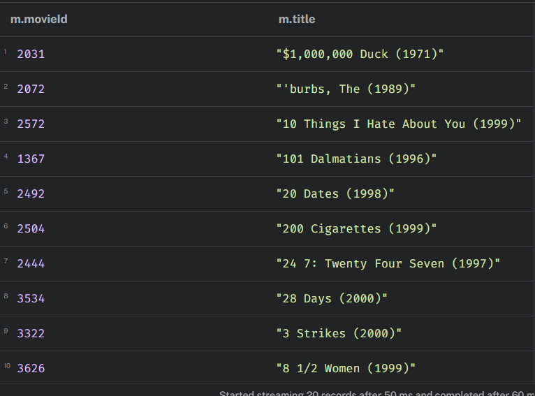

---

## Query 2 — Users Who Rated More Than 50 Movies with 5 Stars

This query finds users who gave the maximum rating (**5 stars**) to more than **50 movies**.

The query groups ratings by user and counts only the maximum ratings.

These users represent the most active positive reviewers in the dataset.

### Screenshot

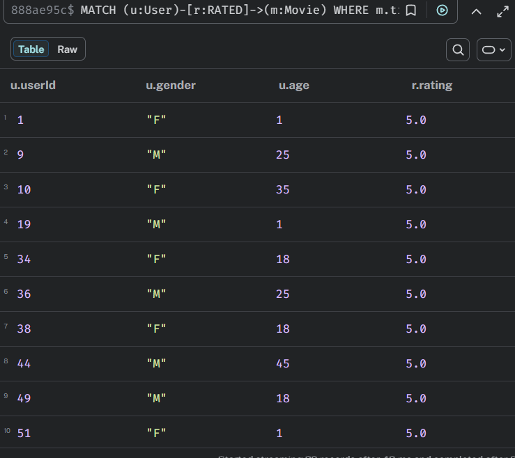

---

## Query 3 — Movies Highly Rated by Two Users

This query finds movies that were rated **4 stars or higher** by both **User 1** and **User 2**.

Since both users are directly connected to Movie nodes through `RATED` relationships, the graph model allows this query to be expressed with a relatively short traversal.

### Screenshot

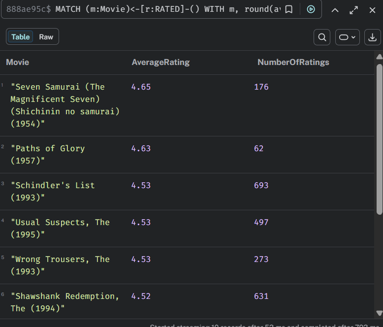

---

## Query 4 — Genre Statistics

This query calculates for each genre:

- average rating;
- total number of ratings.

The results identify genres that consistently receive high ratings rather than genres with only a few highly rated movies.

### Screenshot

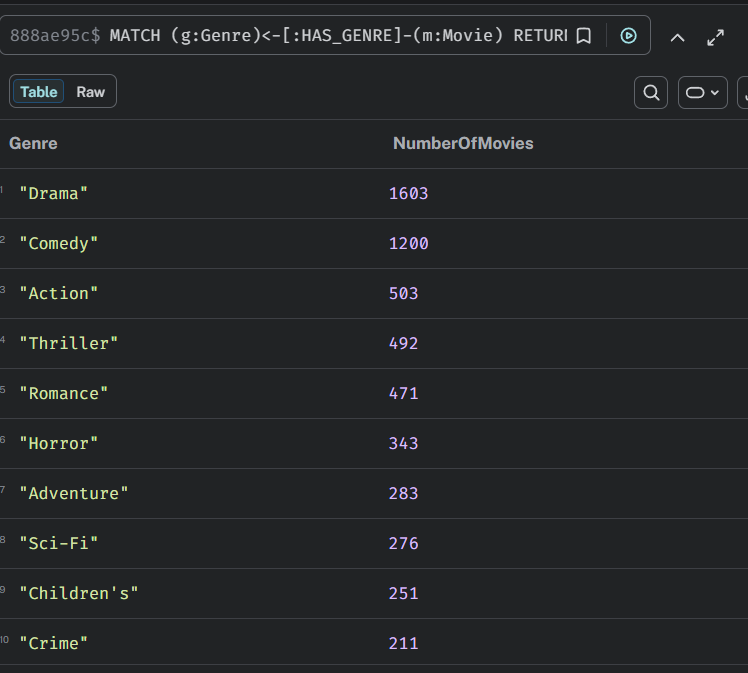

---

## Query 5 — Movie Recommendation

This recommendation follows the collaborative filtering principle:

> Users with similar tastes also liked these movies.

The algorithm:

1. finds users with similar rating behavior;
2. excludes movies already rated by the target user;
3. recommends highly rated movies from similar users.

This query demonstrates one of the main advantages of graph databases, where recommendation logic can be expressed naturally through graph traversals.

### Screenshot

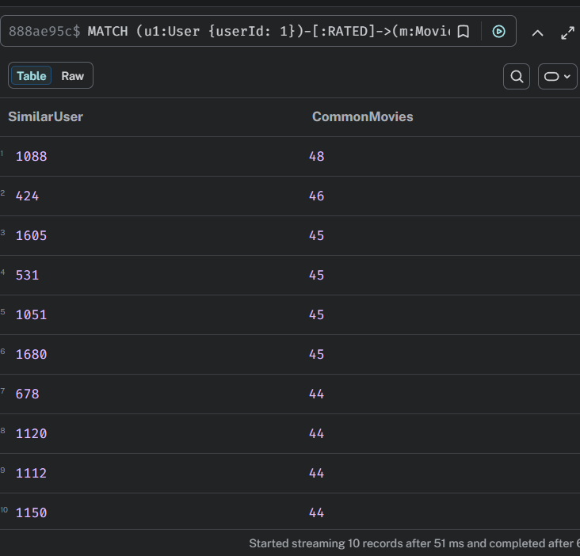

---

## Query 6 — Shortest Path Between Two Users

This query finds the shortest connection between two users through shared movies.

A typical path alternates between User and Movie nodes.

Example:

```text
User → Movie → User
```

This allows discovering indirect similarity between users.

### Screenshot

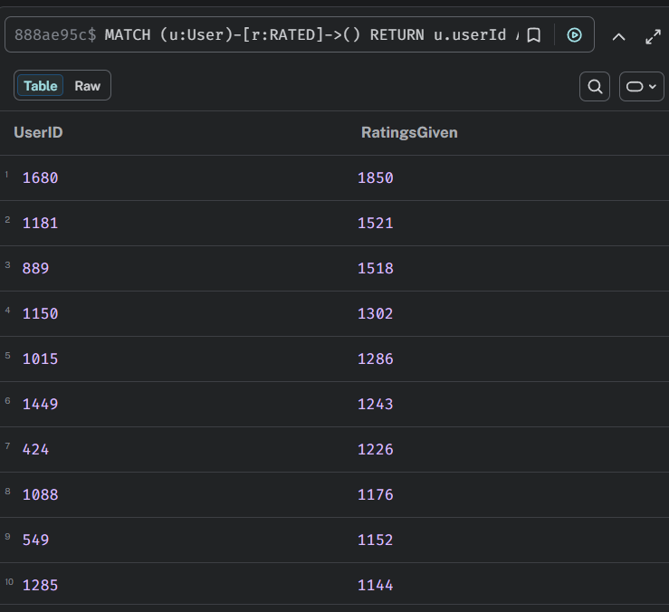

---

# The Meaning of Path Length

## Path Length = 2

```text
User → Movie → User
```

Both users have rated the same movie.

This represents the strongest possible direct similarity.

---

## Path Length = 4

```text
User
 ↓
Movie
 ↓
User
 ↓
Movie
 ↓
User
```

The users are not connected through a common movie directly.

Instead, they are connected through another user who has watched movies similar to both users.

This represents indirect similarity.

---

## Path Length = 6

A path of length six indicates an even weaker connection.

Several intermediate users connect the two target users.

Although the users are still connected within the recommendation graph, their preferences become progressively less similar.

In general, longer paths represent weaker similarity between users.

---

# Part 4 — Supernodes

Supernodes are nodes that have an exceptionally large number of relationships. Although Neo4j is optimized for graph traversals, traversing a supernode may require inspecting thousands of relationships, which increases query execution time.

All queries are stored in:

```text
queries/part4_supernodes.cypher
```

---

## Identifying Supernodes

To identify potential supernodes, the degree of three node types was analyzed:

- Genre nodes;
- Movie nodes;
- User nodes.

The largest Genre nodes were:

| Genre | Movies |
|--------|-------:|
| Drama | 1603 |
| Comedy | 1200 |
| Action | 503 |
| Thriller | 492 |
| Romance | 471 |

Movies with the largest number of ratings and users who rated the largest number of movies were also identified to determine whether they behave as supernodes.

### Screenshot

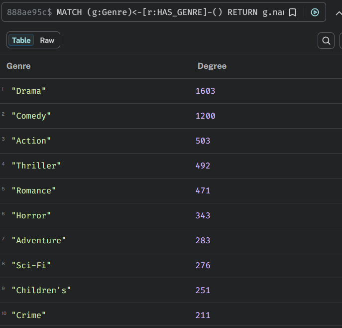

---

# Question 1

## Which nodes became supernodes?

The Genre nodes, especially **Drama** and **Comedy**, clearly became supernodes because they are connected to a very large number of Movie nodes.

Some popular movies also have thousands of incoming `RATED` relationships, while highly active users may create hundreds or thousands of outgoing ratings. However, Genre nodes remain the most significant supernodes in this dataset.

---

# Question 2

## Why are queries involving supernodes slower?

When Neo4j reaches a supernode during traversal, it must inspect every connected relationship before continuing.

For example, traversing the **Drama** node requires examining more than 1,600 relationships.

Although indexes quickly locate the starting node, relationship traversal itself cannot be avoided. Consequently, the traversal cost dominates the total query execution time.

---

# Question 3

## Which optimization strategy is appropriate for this dataset?

Several techniques can reduce the impact of supernodes:

- filter movies before traversing Genre nodes;
- apply rating thresholds to reduce traversal size;
- materialize frequently used relationships;
- use Graph Data Science projections for analytical algorithms instead of repeatedly traversing the stored graph.

For the MovieLens dataset, filtering movies before reaching Genre nodes and using GDS projections are the most effective optimization strategies because they significantly reduce the number of relationships explored during query execution.
---
# Part 5 — Graph Data Science

Three classical Graph Data Science algorithms were applied to the MovieLens dataset:

- PageRank;
- Louvain Community Detection;
- Dijkstra Shortest Path.

Before executing each algorithm, an in-memory graph projection was created because Neo4j GDS algorithms operate on graph projections rather than directly on the stored database.

All queries are stored in:

```text
queries/part5_gds.cypher
```

---

## Graph Projection

Separate graph projections were created for each task.

For PageRank, a graph of movies connected through common highly rated users (`CO_RATED`) was constructed.

For Louvain and Dijkstra, a similarity graph between users (`SIMILAR`) was created based on movies that both users rated highly.

Using graph projections allows analytical algorithms to execute efficiently without modifying the stored database.

### Screenshot

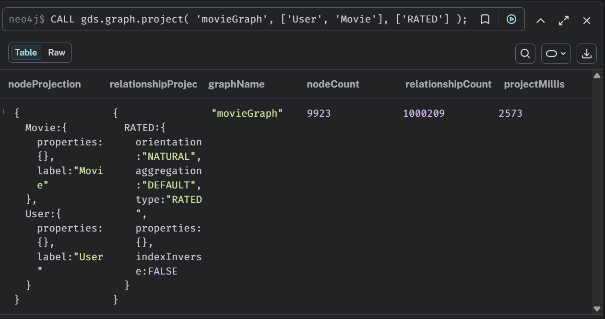

---

## PageRank

PageRank was executed on the Movie similarity graph.

The highest-ranked movies included:

- American Beauty (1999)
- Star Wars Episode VI
- Star Wars Episode IV
- Saving Private Ryan

### Screenshot

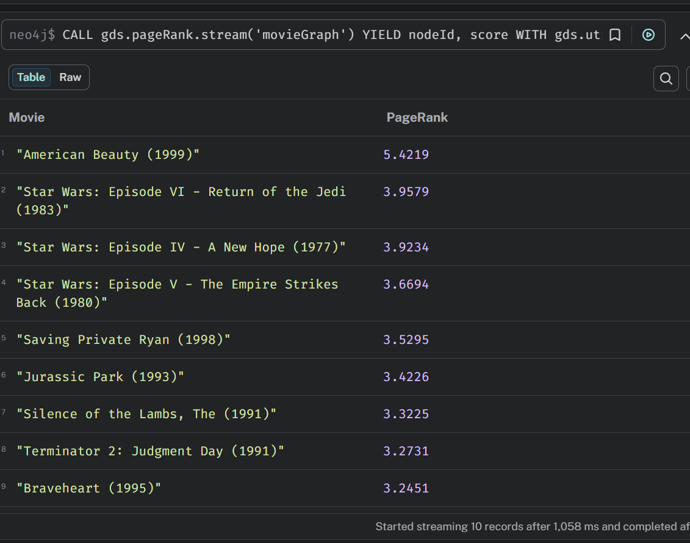

### Interpretation

A high PageRank does **not** simply indicate that a movie is popular.

Instead, it means that the movie is connected to many other highly connected movies through users who rated both movies highly.

Therefore, PageRank measures the structural importance of a movie within the recommendation graph rather than its average rating alone.

---

## Louvain Community Detection

The Louvain algorithm was applied to the User similarity graph.

Several communities of different sizes were identified.

The largest communities contained users with many common highly rated movies.

### Screenshot

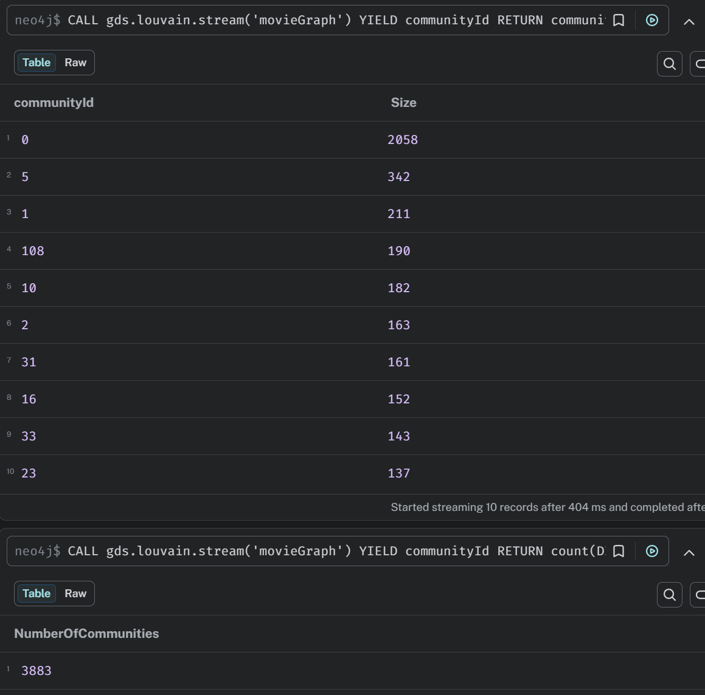

### Community Analysis

The detected communities correspond to groups of users with similar movie preferences.

To verify this assumption, the three most popular genres were determined for every community using movies that received ratings of at least four stars.

Typical dominant genres included:

- Drama
- Comedy
- Action
- Thriller
- Romance

Although communities were not perfectly separated by a single genre, each cluster showed a characteristic distribution of preferred genres.

This confirms that the Louvain algorithm successfully grouped users with similar viewing preferences.

---

## Dijkstra Shortest Path

The Dijkstra algorithm was executed on the User similarity graph generated from the MovieLens dataset.

Similarity weights between users were calculated from the number of movies both users rated highly.

The shortest path was then computed between two selected users.

### Screenshot

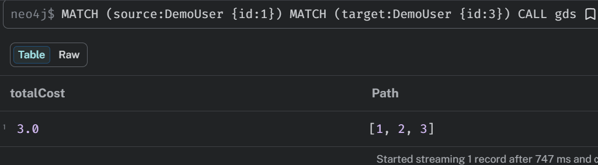

### Interpretation

The resulting path demonstrates how two users can be connected through intermediate users with similar movie preferences.

The algorithm always selects the path with the lowest total cost instead of simply minimizing the number of hops.

This illustrates how weighted shortest-path algorithms can be applied in recommendation systems.

---

## Is This Dataset a Small World?

Several pairs of users were tested.

Most users were connected through only a small number of intermediate users.

This indicates that the MovieLens recommendation graph exhibits typical small-world properties.

---

## Does the Dataset Support the Six Degrees Hypothesis?

Although the exact average path length was not calculated, experiments with multiple user pairs showed relatively short paths between users.

Because many users rate popular movies, the graph remains highly connected.

Therefore, the MovieLens dataset is generally consistent with the small-world phenomenon and broadly supports the intuition behind the "Six Degrees of Separation" hypothesis.

---

# Part 6 — Analysis and Conclusions

## Graph Databases vs Relational Databases

Graph databases are particularly effective for relationship-oriented problems.

For example, the recommendation query:

> "Users with similar tastes also liked these movies."

can be expressed naturally in Cypher by traversing relationships between users and movies.

Implementing the same logic in a relational database would require multiple self-joins between large tables such as `Users`, `Movies`, and `Ratings`. As the traversal depth increases, SQL queries become considerably more complex and less readable.

Graph databases therefore provide a much more intuitive solution for recommendation systems, shortest-path analysis, community detection, and other relationship-based problems.

---

## Where Relational Databases Perform Better

Relational databases remain a better choice for operations that primarily involve tabular data and large-scale aggregations.

Typical examples include:

- reporting;
- business intelligence dashboards;
- aggregation across all users or movies;
- exporting structured datasets.

For example, calculating the average rating for every movie requires only a simple `GROUP BY` query in SQL and is usually more efficient than traversing a graph.

Consequently, graph databases complement rather than replace relational databases.

---

## Possible Schema Improvements

Several modifications could further improve the graph model and query performance.

First, similarity relationships between users could be materialized and periodically updated instead of being recalculated for every recommendation query.

Second, additional indexes or constraints could be created for frequently searched properties to reduce lookup time.

Finally, recommendation relationships could be precomputed and stored inside the graph, allowing recommendation queries to execute almost instantly at the cost of additional storage and periodic recomputation.

---

# Final Conclusion

This project demonstrates how graph databases can effectively model recommendation systems using the MovieLens dataset.

Neo4j provides a natural representation of relationships between users, movies, and genres while enabling complex graph traversals through concise Cypher queries.

The Graph Data Science library extends these capabilities by supporting advanced analytical algorithms such as **PageRank**, **Louvain Community Detection**, and **Dijkstra Shortest Path**, making it possible to identify influential movies, discover user communities, and analyze connectivity within the recommendation graph.

Compared with relational databases, Neo4j greatly simplifies recommendation-oriented queries and graph analytics. At the same time, relational databases remain the preferred solution for reporting, tabular analytics, and large-scale aggregations.

Overall, the project successfully demonstrates graph modeling, efficient data loading, Cypher querying, graph analytics, and recommendation techniques using Neo4j and the MovieLens dataset.
---